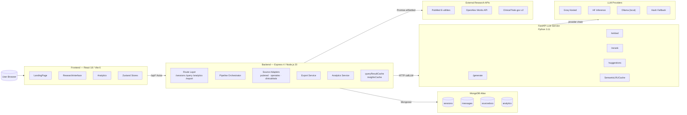
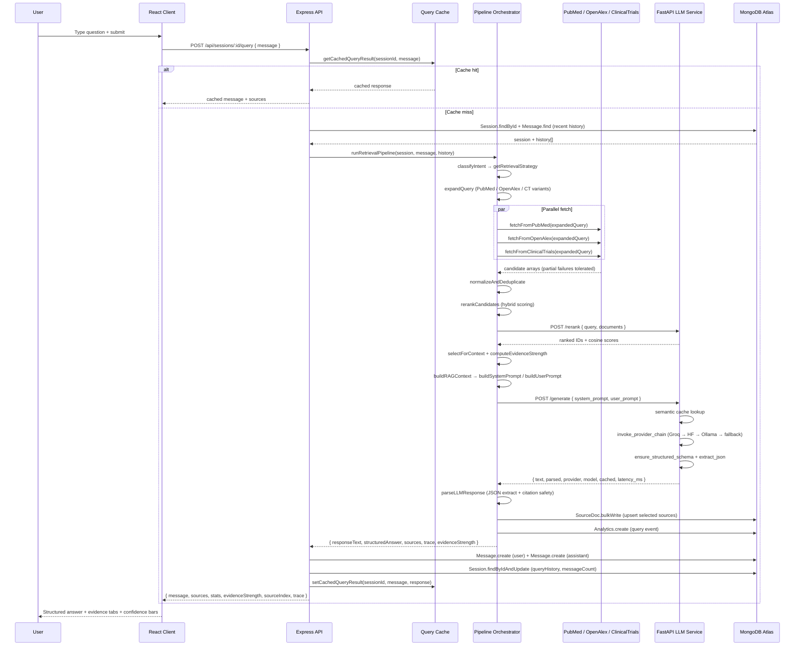
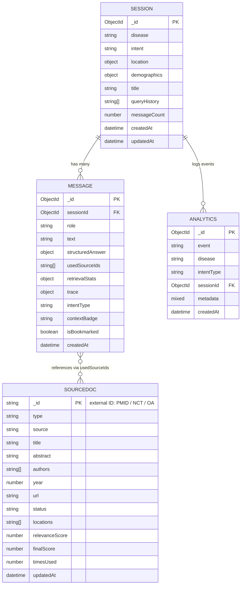

# Curalink

<p align="center">
  
</p>

<p align="center">
  <a href="https://nodejs.org/en/"></a>
  <a href="https://www.python.org/"></a>
  <a href="https://react.dev/"></a>
  <a href="https://fastapi.tiangolo.com/"></a>
  <a href="https://www.mongodb.com/atlas"></a>
  <a href="LICENSE"></a>
  <a href="https://render.com"></a>
  <a href="https://huggingface.co/spaces"></a>
</p>

---

> **Evidence-grounded medical research assistant** — ask disease-focused questions in natural language and receive structured, citation-linked answers sourced in real time from PubMed, OpenAlex, and ClinicalTrials.gov.

---

## Table of Contents

1. [Elevator Pitch](#1-elevator-pitch)
2. [Key Features](#2-key-features)
3. [Full Tech Stack](#3-full-tech-stack)
4. [External APIs](#4-external-apis)
5. [RAG Pipeline — Deep Dive](#5-rag-pipeline--deep-dive)
6. [LLM Service Architecture](#6-llm-service-architecture)
7. [Architecture Diagram](#7-architecture-diagram)
8. [Data Flow Diagram](#8-data-flow-diagram)
9. [Layer-by-Layer Architecture](#9-layer-by-layer-architecture)
10. [Annotated Directory & File Map](#10-annotated-directory--file-map)
11. [graphify-out Folder](#11-graphify-out-folder)
12. [Complete API Reference](#12-complete-api-reference)
13. [Database Schema & Models](#13-database-schema--models)
14. [Key Functions Reference](#14-key-functions-reference)
15. [Setup & Installation](#15-setup--installation)
16. [Environment Variables](#16-environment-variables)
17. [Deployment Guide](#17-deployment-guide)
18. [Design Decisions & Trade-offs](#18-design-decisions--trade-offs)
19. [Known Limitations & Caveats](#19-known-limitations--caveats)
20. [Scripts Reference](#20-scripts-reference)
21. [Contributing Guidelines](#21-contributing-guidelines)
22. [License](#22-license)

---

## 1. Elevator Pitch

**Curalink** is a full-stack, evidence-grounded medical research assistant that bridges the gap between opaque LLM chat tools and raw scientific databases. Users ask natural-language questions about a specific disease; Curalink retrieves real-time candidate evidence from PubMed, OpenAlex, and ClinicalTrials.gov, reranks it with a hybrid scoring pipeline, packages the top sources as structured context, and calls a multi-provider LLM to generate a JSON-schema-constrained answer that cites every claim back to a numbered source (`P1`, `T1`, `A1`).

**The problem it solves:** Generic AI assistants hallucinate and cannot be audited. Raw literature databases require expert query skills. Curalink occupies the middle ground — fast, broad, multi-source triage with full answer traceability.

**Who it is for:**
- **Patients and caregivers** exploring disease-specific research updates in plain language.
- **Clinical researchers and students** who need rapid, broad, multi-source evidence triage.
- **Product and demo environments** where explainable AI and citation traceability are non-negotiable requirements.

---

## 2. Key Features

- 🧠 **Disease-centered research sessions** with optional intent, demographics, and location context that shape retrieval behavior.
- 💬 **Natural-language chat** with structured, citation-grounded answers using explicit citation IDs (`P1`, `T1`, `A1`).
- 🔎 **Parallel multi-source retrieval** from PubMed E-utilities (esearch + XML efetch), OpenAlex Works API, and ClinicalTrials.gov v2 REST API.
- ⚖️ **Hybrid retrieval scoring** combining keyword relevance, recency decay, location match, credibility weight, and intent-driven boosts.
- 🤖 **Optional semantic reranking** via sentence-transformers cosine similarity for improved context ordering.
- 📊 **Confidence breakdown** — evidence strength classified as `LIMITED`, `MODERATE`, or `STRONG` from the retrieved evidence profile.
- 🗂️ **Evidence panels** — tabbed Publications, Clinical Trials, Researchers, and Timeline views.
- 🔖 **Bookmarks, history search** (command palette), and **export** (PDF / JSON / CSV) for every session.
- 📈 **Analytics dashboard** with Recharts visualizations: activity over time, intent distribution, source stats, trial status breakdown.
- ⚡ **Semantic LRU generation cache** at the LLM service tier to avoid redundant provider calls for similar queries.
- 🔗 **Multi-provider LLM chain**: Groq → Hugging Face Inference → Ollama → local hash fallback, tried in order.
- 🔄 **Optional LangGraph workflow mode** — `prepare → generate → parse → fallback` node-based pipeline for transparent generation orchestration.
- 📅 **Session analytics, cron-driven snapshots**, and per-session drilldowns for operational visibility.
- 🛠️ **Full monorepo orchestration** with `concurrently` and dynamic port selection via `start.js`.

---

## 3. Full Tech Stack

Every library, tool, and infrastructure component used across all three services is listed here.

### Frontend

| Technology | Version | Role | Why Chosen |
|---|---|---|---|
| React | 18 | UI component framework | Mature ecosystem, hooks API, composable component model |
| Vite | 6 | Dev server + production bundler | Significantly faster HMR and cold start vs CRA/webpack |
| Tailwind CSS | v4 | Utility-first styling | Design-token speed and consistent visual system without custom CSS sprawl |
| Zustand | latest | Global client state | Minimal API surface; no boilerplate compared to Redux at this scale |
| Axios | latest | HTTP client | Clean interceptors, timeout control, predictable error shapes |
| Recharts | latest | Data visualization | Composable React-native chart components; easy Tailwind theming |
| React Router | v6 | Client-side routing | Declarative nested routing for SPA page model |
| lucide-react | latest | Icon set | Tree-shakeable, consistent stroke-width icon library |
| jsPDF | latest | Client-side PDF generation | Browser-native export path without server round-trip |
| shadcn/ui | (components.json) | Component primitives | Accessible, unstyled base layer on Radix UI; Tailwind-compatible |
| react-rewrite | latest | Visual editing tool | Live WYSIWYG edit → source write-back for React + Vite apps |

### Backend

| Technology | Version | Role | Why Chosen |
|---|---|---|---|
| Node.js | 20 | Runtime | LTS with native ESM, stable tooling ecosystem |
| Express | 4 | HTTP framework | Lightweight, fast iteration, well-understood middleware pipeline |
| Mongoose | 8 | MongoDB ODM | Schema validation, indexes, hooks, familiar API |
| MongoDB Atlas | — | Primary database | Flexible document model handles mixed structured/unstructured payloads |
| Winston | latest | Structured logging | Console + file transports, log levels, production-grade observability |
| node-cron | latest | Task scheduler | Minimal dependency for periodic analytics snapshot jobs |
| xml2js | latest | XML parser | Required for NCBI PubMed efetch XML response format |
| helmet | latest | HTTP security headers | One-line express hardening against common header-based attacks |
| cors | latest | CORS policy | Configurable origin allowlist for multi-origin local/prod configs |
| morgan | latest | HTTP request logging | Combined-format access logs routed through Winston |
| express-rate-limit | latest | Rate limiting | Protect public-facing routes from abuse without external infrastructure |
| compression | latest | Gzip response compression | Reduces payload size for large source/analytics responses |
| concurrently | latest | Process orchestration | Runs multiple npm scripts in parallel from a single terminal |

### LLM Service

| Technology | Version | Role | Why Chosen |
|---|---|---|---|
| FastAPI | 0.110+ | Async Python API framework | Async-ready, automatic OpenAPI, typed request/response via Pydantic |
| Pydantic | v2 | Request/response validation | Runtime schema enforcement for generation contracts |
| sentence-transformers | latest | Local embedding model | Good quality-speed balance for semantic cache and reranking |
| Groq SDK (`groq`) | latest | Hosted LLM provider | Low-latency inference without self-hosting full model weights |
| Ollama | — | Local model runtime | Offline/local dev path; controllable local model serving |
| LangGraph | latest | Generation workflow engine | Explicit node-based pipeline with recoverable fallback stages |
| LangChain Core | latest | LLM chain primitives | Shared message/prompt/chain abstractions used by LangGraph nodes |
| uvicorn | latest | ASGI server | Production-ready async server for FastAPI |
| httpx | latest | Async HTTP client | Native async support for provider chain calls |

### Infrastructure

| Technology | Role | Why Chosen |
|---|---|---|
| Docker | Container image for `llm-service` and HF Space | Reproducible Python environment with pinned deps |
| Render (`render.yaml`) | Multi-service cloud deployment | Simple YAML-driven service definitions; free-tier friendly |
| Hugging Face Spaces | LLM service hosting alternative | Zero-cost GPU/CPU space, native model support |
| Vite proxy (`vite.config.js`) | Local `/api` proxy to backend | Same-origin dev API calls without CORS setup |
| Git LFS (`.gitattributes`) | Large binary/model artifact tracking | Avoids repo bloat for model files in HF Space |

### Dev Tools & Scripts

| Tool/File | Role |
|---|---|
| `start.js` | Multi-service startup with dynamic port allocation and provider env forwarding |
| `scripts/generate-project-context.mjs` | Snapshots routes/env/tree/dependencies → `PROJECT_CONTEXT.json` + `.md` |
| `scripts/integration-smoke.mjs` | Full end-to-end integration smoke test runner |
| `scripts/latency-bench.mjs` | Latency benchmark runner that writes results to `graphify-out/` |
| `graphify-out/graph.html` | Interactive module dependency graph visualization |
| `graphify-out/graph.json` | Machine-readable module graph data |
| `graphify-out/GRAPH_REPORT.md` | Human-readable graph analysis report |

---

## 4. External APIs

Curalink fetches live evidence from three public research APIs and delegates generation to three possible LLM providers. No data is stored from external APIs beyond what is explicitly persisted in MongoDB.

| API | Provider | Used For | Auth Method | Adapter File |
|---|---|---|---|---|
| PubMed E-utilities (`esearch` + `efetch` XML) | NCBI / NLM | Biomedical literature retrieval; structured XML article metadata | API key optional; `PUBMED_EMAIL` polite identifier in `tool` param | `server/src/services/apis/pubmed.js` |
| OpenAlex Works API | OurResearch | Open scholarly works with abstracts and author metadata | No auth required (rate-limited by IP) | `server/src/services/apis/openalex.js` |
| ClinicalTrials.gov v2 REST API | NIH | Active and completed clinical trials with status/location/contact | No auth required | `server/src/services/apis/clinicaltrials.js` |
| Groq Hosted LLM Inference | Groq | Fast hosted LLM generation (primary provider) | `GROQ_API_KEY` Bearer token | `llm-service/main.py` |
| Hugging Face Inference API | Hugging Face | Hosted model inference (secondary provider) | `HF_API_TOKEN` Bearer token | `llm-service/main.py` + `hf-space-curalink-llm/` |
| Ollama Local Model Runtime | Ollama (self-hosted) | Local LLM generation and embedding (fallback provider) | No auth (localhost) | `llm-service/main.py` |

---

## 5. RAG Pipeline — Deep Dive

The retrieval-augmented generation (RAG) pipeline is the core of Curalink. Every query traverses 13 discrete steps, each implemented in a dedicated module. The pipeline is invoked by `runRetrievalPipeline()` in `server/src/services/pipeline/orchestrator.js`.

### Step 1 — Intent Classification (`intentClassifier.js`)

`classifyIntent(query, sessionIntent)` applies a heuristic keyword-and-pattern map over the user query to assign one of several intent types: `TREATMENT`, `DIAGNOSIS`, `PROGNOSIS`, `PREVENTION`, `MECHANISM`, `CLINICAL_TRIAL`, `GENERAL`. The companion function `getRetrievalStrategy(intent)` returns a strategy object that controls source weights, fetch limits per source, and whether clinical trials are boosted in ranking.

```js
// server/src/services/pipeline/intentClassifier.js
const strategy = getRetrievalStrategy(classifyIntent(query, session.intent));
// strategy = { sources: ['pubmed','openalex','clinicaltrials'], boostTrials: true, ... }
```

### Step 2 — Query Expansion (`queryExpander.js`)

`expandQuery(query, disease, intent, strategy)` produces source-specific query strings:
- **PubMed**: adds MeSH-like qualifiers (`[MeSH Terms]`, `[Title/Abstract]`) and disease synonyms.
- **OpenAlex**: constructs a filter string with concept IDs and title/abstract search.
- **ClinicalTrials**: builds condition + intervention search terms from the intent type.

This prevents over-generalized queries that return irrelevant results from each API's unique search syntax.

### Step 3 — Parallel Candidate Fetch

Three adapter functions are called concurrently via `Promise.allSettled`:

- `fetchFromPubMed(expandedQuery, limit)` — calls `esearch` to get PMIDs, then `efetch` with XML format, parses with `xml2js`, and extracts title, abstract, authors, year, journal, and PMID.
- `fetchFromOpenAlex(expandedQuery, limit)` — calls the Works API, reconstructs abstract from inverted-index format, and extracts authors and concept labels.
- `fetchFromClinicalTrials(expandedQuery, limit)` — calls the v2 `/studies` endpoint, extracts trial status, phase, locations, contacts, and eligibility.

Partial failures from any single source are tolerated; `Promise.allSettled` ensures the pipeline continues with the results that were returned.

### Step 4 — Normalization & Deduplication (`normalizer.js`)

`normalizeAndDeduplicate(pubmedResults, openAlexResults, ctResults)` maps all three candidate arrays into a **unified source shape**:

```js
{
  _id,          // external ID (PMID / OpenAlex ID / NCT number)
  type,         // 'publication' | 'trial'
  source,       // 'pubmed' | 'openalex' | 'clinicaltrials'
  title,
  abstract,
  authors,
  year,
  url,
  status,       // trial status or null
  locations,    // trial sites or []
}
```

Deduplication uses a `Set` of normalized titles (lowercase, punctuation-stripped) to remove cross-source duplicates before scoring.

### Step 5 — Hybrid Reranking (`reranker.js`)

`rerankCandidates(candidates, query, session, strategy)` scores each candidate on five dimensions:

| Signal | Weight Basis |
|---|---|
| Keyword match | TF-style overlap of query tokens in title + abstract |
| Recency | Exponential decay from current year; newer = higher |
| Location match | Boost if trial location matches session location |
| Source credibility | PubMed > OpenAlex > ClinicalTrials baseline weight |
| Intent boost | Strategy-driven source type multipliers |

`finalScore = keywordScore × keywordWeight + recencyScore × recencyWeight + locationBoost + credibilityBase + intentBoost`

Candidates are sorted descending by `finalScore`.

### Step 6 — Semantic Rerank (`llm.js` → FastAPI `/rerank`)

If the top candidate pool exceeds a skip-threshold (default: high scores already clustered), `semanticRerank(query, candidates, topK)` in `server/src/services/llm.js` calls `POST /rerank` on the FastAPI service. The LLM service encodes the query and all candidate titles+abstracts with sentence-transformers, computes cosine similarity, and returns ranked IDs. The backend then reorders the candidate array by the returned scores.

This step is skipped when the LLM service is unavailable; the hybrid scores serve as the fallback ordering.

### Step 7 — Context Selection + Evidence Strength (`reranker.js`)

`selectForContext(rankedCandidates, maxTokenBudget)` picks the top-N candidates that fit within the prompt token budget, returning a citation-indexed subset.

`computeEvidenceStrength(selectedCandidates)` inspects the profile:
- `STRONG` — multiple high-scoring publications + active trials.
- `MODERATE` — mix of sources with moderate scores.
- `LIMITED` — few sources, low scores, or trials-only.

### Step 8 — RAG Context Build (`contextPackager.js`)

`buildRAGContext(selectedCandidates)` returns:
```js
{
  contextText,   // numbered citation blocks: "[P1] Title. Abstract..."
  sourceIndex,   // { P1: sourceDocId, T1: sourceDocId, ... }
}
```

Each citation block uses a type-prefixed ID (`P` = publication, `T` = trial, `A` = author aggregation) that the LLM is instructed to reference in its answer.

### Step 9 — Prompt Engineering (`contextPackager.js`)

`buildSystemPrompt(evidenceStrength, sourceIndex)` constructs a strict JSON output-contract system prompt. It instructs the model to:
- Return only a valid JSON object (no markdown wrappers).
- Include every claim with `[P1]`, `[T1]` citation anchors.
- Use only the provided source IDs; never invent new citations.
- Populate `summary`, `keyFindings[]`, `limitations`, `evidenceStrength`, `usedSourceIds[]`.

`buildUserPrompt(query, contextText, session)` injects the user's disease, intent, demographics, location, conversation history, and the citation-indexed context text.

### Step 10 — LLM Generation (FastAPI `/generate`)

The backend calls `callLLM(systemPrompt, userPrompt)` in `server/src/services/llm.js`, which POSTs to `POST /generate` on the FastAPI service.

Inside the LLM service (`llm-service/main.py`):
1. **Semantic cache lookup** — embeds the prompt and checks `SemanticLRUCache` for a similar previous response above the similarity threshold.
2. **Provider chain invocation** — `invoke_provider_chain()` tries providers in order: `groq → huggingface → ollama → local_fallback`.
3. **Schema enforcement** — `ensure_structured_schema()` validates and fills missing fields.
4. **JSON extraction** — `extract_json()` uses regex + bracket-depth parsing to extract valid JSON from raw model text.

If `USE_LANGGRAPH_WORKFLOW=true`, generation routes through a LangGraph state graph: `prepare_node → generate_node → parse_node → fallback_node`.

### Step 11 — Response Parsing (`llm.js` `parseLLMResponse`)

`parseLLMResponse(rawText, sourceIndex)` in `server/src/services/llm.js`:
- Extracts JSON from the model's response text with multi-strategy regex + bracket matching.
- Normalizes the schema: ensures `keyFindings` is an array, `usedSourceIds` references only valid citation IDs.
- Falls back to a safe synthetic answer with `evidenceStrength: 'LIMITED'` if parsing fails completely.

### Step 12 — Persistence (`orchestrator.js`)

After successful parsing:
- `SourceDoc.bulkWrite(upsertOps)` — upserts all selected source documents into MongoDB using their external ID as `_id`, incrementing `timesUsed` on each match.
- `Message.create({ role: 'user', ... })` and `Message.create({ role: 'assistant', structuredAnswer, usedSourceIds, retrievalStats, trace })` — persist both sides of the exchange.
- `Session.findByIdAndUpdate(id, { $push: { queryHistory: query }, $inc: { messageCount: 2 } })` — updates session metadata.

### Step 13 — Analytics Event (`analyticsService.js`)

`Analytics.create({ event: 'query', disease, intentType, sessionId, metadata: { latency, sourceCount, provider } })` is written asynchronously after the main response is returned to the frontend. This keeps the query latency on the critical path unaffected by analytics writes.

---

## 6. LLM Service Architecture

The FastAPI service (`llm-service/main.py`) is a self-contained Python microservice that handles all model-interaction concerns. It is designed to degrade gracefully when providers are unavailable.

### Endpoints

| Endpoint | Flow |
|---|---|
| `POST /generate` | Semantic cache lookup → `invoke_provider_chain` → `ensure_structured_schema` → `extract_json` → cache store |
| `POST /embed` | sentence-transformers encode → Ollama embed fallback → hash-based synthetic embedding |
| `POST /rerank` | Encode query + documents → cosine similarity matrix → return ranked IDs + scores |
| `POST /suggestions` | Build suggestion prompt → provider chain (short max_tokens) → parse suggestion list |
| `GET /health` | Return provider availability, cache stats, uptime |

### SemanticLRUCache (`cache/semantic_cache.py`)

`SemanticLRUCache(max_size, similarity_threshold)` maintains an ordered dict of `(embedding_vector, response)` pairs. On each lookup:
1. Embed the incoming prompt.
2. Compute cosine similarity against all cached embeddings.
3. Return the cached response if `max_similarity >= threshold`.
4. Evict the least-recently-used entry when `max_size` is exceeded.

Cache hit rate and size are exposed through `/health`.

### Provider Chain (`invoke_provider_chain`)

```
groq  →  huggingface  →  ollama  →  local_fallback
```

Each provider is tried in sequence. A provider is skipped if its credentials are absent or if it raises an exception. `local_fallback` generates a deterministic hash-based synthetic answer and is always available.

### LangGraph Workflow (`USE_LANGGRAPH_WORKFLOW=true`)

When enabled, generation is routed through a four-node LangGraph state graph:

| Node | Responsibility |
|---|---|
| `prepare_node` | Validate and format prompt state |
| `generate_node` | Call `invoke_provider_chain` |
| `parse_node` | Apply `extract_json` + `ensure_structured_schema` |
| `fallback_node` | Triggered on parse failure; returns safe synthetic schema |

### Pydantic v2 Schemas

**Request — `/generate`:**
```python
class GenerateRequest(BaseModel):
    system_prompt: str
    user_prompt: str
    temperature: float = 0.3
    max_tokens: int = 2048
```

**Response — `/generate`:**
```python
class GenerateResponse(BaseModel):
    text: str
    parsed: dict | None
    provider: str
    model: str
    cached: bool
    latency_ms: float
    trace: dict
```

**Request — `/rerank`:**
```python
class RerankRequest(BaseModel):
    query: str
    documents: list[str]
    top_k: int = 10
```

**Request — `/embed`:**
```python
class EmbedRequest(BaseModel):
    texts: list[str]
```

---

## 7. Architecture Diagram

The following flowchart shows the complete system topology from user browser to external providers.



---

## 8. Data Flow Diagram

The following sequence diagram traces a single user query from browser to browser.



---

## 9. Layer-by-Layer Architecture

Curalink is organized into seven distinct architectural layers. Each layer has a single, well-defined responsibility and communicates with adjacent layers through typed contracts.

### Layer 1 — UI

| Attribute | Detail |
|---|---|
| **Purpose** | User interaction, evidence visualization, analytics presentation |
| **Key modules** | `LandingPage`, `ResearchInterface`, `Analytics`, `ChatPanel`, `EvidencePanel`, `BookmarksPanel`, `HistoryCommandPalette` |
| **Technologies** | React 18, React Router v6, Tailwind CSS v4, Recharts, lucide-react |
| **Connection to Layer 2** | Reads/writes Zustand stores; calls functions exported from `client/src/utils/api.js` |

### Layer 2 — Frontend State & Integration

| Attribute | Detail |
|---|---|
| **Purpose** | Normalize client-side app state; manage API call behavior and error handling |
| **Key modules** | `useAppStore.js`, `useToastStore.js`, `api.js`, `useTheme.js` |
| **Technologies** | Zustand, Axios |
| **Connection to Layer 3** | Calls backend REST endpoints; maps responses into store slices consumed by UI components |

### Layer 3 — API

| Attribute | Detail |
|---|---|
| **Purpose** | Request validation, route contracts, middleware policy, health/status exposure |
| **Key modules** | `app.js`, `routes/query.js`, `routes/sessions.js`, `routes/analytics.js`, `routes/export.js` |
| **Technologies** | Express 4, helmet, cors, morgan, express-rate-limit, compression |
| **Connection to Layer 4** | Invokes pipeline orchestrator and service functions; returns normalized JSON to Layer 2 |

### Layer 4 — Business Logic

| Attribute | Detail |
|---|---|
| **Purpose** | Retrieval pipeline, hybrid scoring, context packaging, LLM calls, exports, analytics rollups |
| **Key modules** | `orchestrator.js`, `intentClassifier.js`, `queryExpander.js`, `normalizer.js`, `reranker.js`, `contextPackager.js`, `pubmed.js`, `openalex.js`, `clinicaltrials.js`, `llm.js`, `analyticsService.js`, `export.js` |
| **Technologies** | Axios, custom scoring algorithms, semantic rerank delegation |
| **Connection to Layers 5 & 6** | Persists results via Mongoose; calls FastAPI LLM service over HTTP |

### Layer 5 — Data

| Attribute | Detail |
|---|---|
| **Purpose** | Durable session history, source reuse tracking, analytics event storage |
| **Key modules** | `Session.js`, `Message.js`, `SourceDoc.js`, `Analytics.js` |
| **Technologies** | Mongoose 8, MongoDB Atlas |
| **Connection to Layer 4** | Provides model classes and query API consumed by business logic services |

### Layer 6 — Model Service

| Attribute | Detail |
|---|---|
| **Purpose** | Generation, embedding, reranking, suggestions; provider chain fallback; semantic cache |
| **Key modules** | `llm-service/main.py`, `llm-service/cache/semantic_cache.py` |
| **Technologies** | FastAPI, Pydantic v2, sentence-transformers, Groq SDK, httpx, LangGraph, LangChain Core |
| **Connection to Layer 7** | Calls external LLM provider APIs; returns structured responses to Layer 4 |

### Layer 7 — External Sources

| Attribute | Detail |
|---|---|
| **Purpose** | Live retrieval of biomedical literature, trial registrations, and scholarly works |
| **Key modules** | PubMed E-utilities, OpenAlex Works API, ClinicalTrials.gov v2, Groq API, HF Inference API, Ollama |
| **Technologies** | REST/XML APIs (public), hosted model APIs |
| **Connection to Layer 4** | Returns raw candidate arrays consumed by the normalization step |

---

## 10. Annotated Directory & File Map

Every source file is listed with its role. Runtime-generated artifacts are grouped with wildcards.

```text
Curalink/
├── .env.example                         # Root-level env template for local defaults
├── .gitignore                           # Ignores: node_modules, __pycache__, logs, graphify-out artifacts
├── .gitattributes                       # Git LFS patterns for model/binary artifacts in HF Space
├── components.json                      # shadcn/ui component generator config (style, aliases, rsc)
├── integration-smoke.mjs                # Root proxy that delegates to scripts/integration-smoke.mjs
├── jsconfig.json                        # IDE/tooling path aliases for workspace
├── main.py                              # Root ASGI compatibility shim forwarding to llm-service/main.py
├── package.json                         # Root monorepo scripts: start:all, doctor, check:*, rewrite
├── package-lock.json                    # Root lockfile
├── render.yaml                          # Render deployment spec: curalink-api + curalink-llm services
├── start.js                             # Multi-service orchestrator with dynamic port allocation
├── PROJECT_CONTEXT.json                 # Generated machine-readable project context snapshot
├── PROJECT_CONTEXT.md                   # Generated human-readable project context snapshot
├── README.md                            # This file
│
├── .github/
│   └── agents/
│       ├── prd-backend-pipeline.agent.md    # Agent instructions for backend pipeline implementation
│       ├── prd-frontend-experience.agent.md # Agent instructions for frontend feature implementation
│       ├── prd-llm-rag.agent.md             # Agent instructions for LLM/RAG layer implementation
│       ├── prd-sync-orchestrator.agent.md   # Cross-layer orchestration and sync guidance
│       └── prd-validation-sync.agent.md     # Validation and cross-service sync instructions
│
├── client/
│   ├── .env.example                     # Frontend env template (VITE_APP_NAME, VITE_API_URL)
│   ├── .env.production                  # Frontend production API endpoint override
│   ├── index.html                       # Vite HTML entry point; mounts #root
│   ├── package.json                     # Frontend deps: react, vite, tailwind, zustand, recharts, etc.
│   ├── package-lock.json                # Frontend lockfile
│   ├── tailwind.config.js               # Tailwind content paths and theme extensions
│   ├── vite.config.js                   # Vite plugins, path aliases (@/), /api proxy to backend
│   ├── public/
│   │   ├── favicon.ico                  # Browser tab favicon
│   │   └── favicon.svg                  # SVG app icon (used in navbar)
│   └── src/
│       ├── App.jsx                      # Route registration with React Router; suspense boundaries
│       ├── main.jsx                     # React app bootstrap; BrowserRouter + StrictMode mount
│       ├── styles.css                   # Global Tailwind base + design token surface classes
│       ├── components/
│       │   ├── ContextForm.jsx                  # Session creation context form (disease/intent/location/demographics)
│       │   ├── analytics/
│       │   │   ├── AnalyticsBadge.jsx           # Status/label badge for analytics events
│       │   │   ├── AnalyticsCard.jsx            # Generic card container for analytics sections
│       │   │   ├── AnalyticsChartsTabs.jsx      # Tabbed section hosting all Recharts visualizations
│       │   │   ├── AnalyticsLoadingSkeleton.jsx # Skeleton loader variant for analytics data
│       │   │   ├── AnalyticsMetricCard.jsx      # Single metric tile with accent color and delta
│       │   │   ├── AnalyticsSkeleton.jsx        # Composite analytics page loading state
│       │   │   ├── AnalyticsStateNotice.jsx     # Empty state / error notice block for analytics
│       │   │   ├── AnalyticsTabs.jsx            # Tab switcher between Overview and Session views
│       │   │   ├── OverviewCharts.jsx           # Composition of activity/intent/source charts
│       │   │   ├── OverviewMetrics.jsx          # Summary metrics composition (queries, sessions, etc.)
│       │   │   ├── SessionBreakdownPanel.jsx    # Per-session analytics drilldown panel
│       │   │   └── SystemStatusWidget.jsx       # Health polling widget (DB / LLM / API status)
│       │   ├── chat/
│       │   │   ├── ChatInput.jsx                # Auto-resizing textarea with suggestion chips
│       │   │   ├── ChatPanel.jsx                # Chat orchestration: send, scroll, loading states
│       │   │   ├── MessageBubble.jsx            # Per-message renderer with citation + bookmark actions
│       │   │   └── StructuredAnswer.jsx         # Structured answer block with findings + evidence strength
│       │   ├── evidence/
│       │   │   ├── EvidencePanel.jsx            # Tabbed container: Publications / Trials / Researchers / Timeline
│       │   │   ├── PublicationsTab.jsx          # Publication cards with abstract, authors, search + pagination
│       │   │   ├── ResearchersTab.jsx           # Author aggregation and researcher spotlight list
│       │   │   ├── TimelineTab.jsx              # Conversation-level evidence timeline
│       │   │   └── TrialsTab.jsx                # Clinical trial cards with status/phase/location metadata
│       │   ├── features/
│       │   │   ├── BookmarksPanel.jsx           # Bookmarked message list grouped by session
│       │   │   ├── BookmarkToggle.jsx           # API-wired toggle for bookmarking an assistant message
│       │   │   ├── EvidenceConfidenceBars.jsx   # Horizontal bar chart for evidence confidence scores
│       │   │   ├── EvidenceConfidenceHeatmap.jsx # Source-level confidence table/heatmap
│       │   │   ├── HistoryCommandPalette.jsx    # Keyboard-driven modal for searching message history
│       │   │   ├── SessionExportMenu.jsx        # Export trigger: PDF / JSON / CSV download UX
│       │   │   └── SystemStatusBanner.jsx       # Global API / DB / LLM availability status banner
│       │   ├── layout/
│       │   │   └── AppTopNav.jsx                # Top navigation bar with theme toggle and nav links
│       │   ├── sidebar/
│       │   │   ├── ExportButton.jsx             # Sidebar-mounted export shortcut button
│       │   │   └── Sidebar.jsx                  # Session metadata display + retrieval stats + controls
│       │   └── ui/
│       │       ├── Button.jsx                   # Variant button primitive (primary/secondary/ghost)
│       │       ├── Card.jsx                     # Variant card primitive with header/body/footer slots
│       │       ├── ErrorBanner.jsx              # Dismissable error banner for API/network failures
│       │       ├── LoadingOverlay.jsx           # Full-screen loading scaffold with spinner
│       │       ├── ThemeToggle.jsx              # Light/dark mode toggle using useTheme hook
│       │       ├── ToastViewport.jsx            # App-wide Radix toast stack renderer
│       │       └── textarea.jsx                 # Styled textarea primitive with auto-resize support
│       ├── hooks/
│       │   └── useTheme.js                      # Light/dark theme mode with localStorage persistence
│       ├── lib/
│       │   └── utils.js                         # `cn` (clsx+twMerge), `clamp`, keyboard event helpers
│       ├── pages/
│       │   ├── Analytics.jsx                    # Current analytics dashboard route component
│       │   ├── AnalyticsDashboard.jsx           # Legacy / alternate analytics dashboard (retained)
│       │   ├── LandingPage.jsx                  # Session creation, suggestion chips, start flow
│       │   └── ResearchInterface.jsx            # Main 3-panel research workspace + bootstrap logic
│       ├── store/
│       │   ├── useAppStore.js                   # Central Zustand store: session, messages, sources, tab, errors
│       │   └── useToastStore.js                 # Toast state + push/dismiss action creators
│       └── utils/
│           └── api.js                           # Axios instance, all API call functions, health cache
│
├── server/
│   ├── .env                                 # Local dev env (⚠️ contains live secrets — do not commit)
│   ├── .env.example                         # Backend env template with all required variables
│   ├── .node-version                        # Node runtime version pin (20.x)
│   ├── package.json                         # Backend deps: express, mongoose, winston, etc.
│   ├── package-lock.json                    # Backend lockfile
│   ├── logs/
│   │   ├── combined.log                     # Aggregated runtime logs (artifact — gitignored)
│   │   └── error.log                        # Error-level runtime logs (artifact — gitignored)
│   └── src/
│       ├── app.js                           # Express boot, /health endpoint, Mongo connect, scheduler
│       ├── lib/
│       │   ├── llmServiceAuth.js            # Optional bearer token header builder for LLM calls
│       │   └── logger.js                    # Winston logger: console + file transports, log levels
│       ├── middleware/
│       │   ├── errorHandler.js              # Maps thrown errors to HTTP status codes + JSON response
│       │   ├── gzipCompression.js           # Custom JSON gzip middleware wrapping `compression`
│       │   ├── insightsCache.js             # Request-level insights response cache middleware
│       │   └── requestLogger.js             # Per-request timing logger (ms) via Winston
│       ├── models/
│       │   ├── Analytics.js                 # Analytics event schema + indexes
│       │   ├── Message.js                   # Message + structuredAnswer schema + indexes
│       │   ├── Session.js                   # Session metadata schema + indexes
│       │   └── SourceDoc.js                 # Normalized source document schema + indexes
│       ├── routes/
│       │   ├── analytics.js                 # GET analytics/overview, breakdown, top-diseases, etc.
│       │   ├── export.js                    # GET sessions/:id/export (PDF/JSON/CSV)
│       │   ├── query.js                     # POST sessions/:id/query, GET suggestions
│       │   └── sessions.js                  # Session CRUD, bookmarks, insights, sources, history search
│       └── services/
│           ├── analyticsService.js          # Aggregation-based analytics payload builders
│           ├── briefGenerator.js            # Session brief synthesis from persisted conversation+evidence
│           ├── export.js                    # JSON/CSV/PDF export construction (jsPDF backend path)
│           ├── healthContract.js            # Health response normalization and status patching
│           ├── insightsCache.js             # LRU-like insights cache read/write helpers
│           ├── llm.js                       # HTTP client bridge to FastAPI: callLLM, parseLLMResponse, semanticRerank
│           ├── queryResultCache.js          # Per-session query response cache with TTL + LRU eviction
│           ├── scheduler.js                 # node-cron periodic analytics snapshot writer
│           ├── sessionInsights.js           # Insight payload builders, latency stats, source utilities
│           ├── apis/
│           │   ├── clinicaltrials.js        # ClinicalTrials.gov v2 REST adapter
│           │   ├── openalex.js              # OpenAlex Works API adapter
│           │   └── pubmed.js               # PubMed esearch + efetch XML adapter
│           └── pipeline/
│               ├── contextPackager.js       # buildRAGContext, buildSystemPrompt, buildUserPrompt
│               ├── intentClassifier.js      # classifyIntent, getRetrievalStrategy
│               ├── normalizer.js            # normalizeAndDeduplicate (unified source shape)
│               ├── orchestrator.js          # runRetrievalPipeline (full pipeline entry point)
│               ├── queryExpander.js         # expandQuery (source-specific query variants)
│               ├── reranker.js              # rerankCandidates, selectForContext, computeEvidenceStrength
│               └── retriever.js            # ⚠️ Placeholder — not used by orchestrator
│
├── llm-service/
│   ├── .python-version                      # Python version pin (3.11.x)
│   ├── Dockerfile                           # LLM service container image (Python 3.11 slim)
│   ├── main.py                              # FastAPI app: /generate /embed /rerank /suggestions /health
│   ├── requirements.txt                     # Python dependency pins
│   ├── start.sh                             # Runtime start: provider detection + uvicorn launch
│   └── cache/
│       ├── __init__.py                      # Cache module package exports
│       └── semantic_cache.py               # SemanticLRUCache: similarity-aware LRU cache
│
├── hf-space-curalink-llm/
│   ├── .gitattributes                       # Git LFS patterns for HF Space model artifacts
│   ├── Dockerfile                           # HF Space container spec (mirrors llm-service)
│   ├── main.py                              # HF Space LLM service entry (mirrors llm-service/main.py)
│   ├── README.md                            # HF Space metadata card (title, emoji, sdk: docker)
│   ├── requirements.txt                     # HF Space Python dependencies
│   └── start.sh                             # HF Space startup script
│
├── hf-space-curalink-llm2/
│   ├── Dockerfile                           # Alternate HF Space container spec
│   ├── main.py                              # Alternate HF Space LLM service entry
│   ├── README.md                            # HF Space metadata card for alternate space
│   ├── requirements.txt                     # Alternate HF Space dependencies
│   └── start.sh                             # Alternate HF Space startup script
│
├── scripts/
│   ├── generate-project-context.mjs         # Snapshots routes/env/tree/deps → PROJECT_CONTEXT.json + .md
│   ├── integration-smoke.mjs                # Spawns all services and runs end-to-end smoke assertions
│   └── latency-bench.mjs                    # Runs timed query benchmarks; writes to graphify-out/
│
├── logs/                                    # Root log output directory (runtime artifact)
│
└── graphify-out/
    ├── graph.html                           # Interactive D3-based module dependency visualization
    ├── graph.json                           # Machine-readable graph (nodes = modules, edges = imports)
    ├── GRAPH_REPORT.md                      # Human-readable Graphify analysis report
    ├── manifest.json                        # Graphify run metadata (timestamp, config, entrypoints)
    ├── cost.json                            # Token usage + cost metrics from graph generation run
    ├── memory-map-<timestamp>.json          # In-memory module map snapshot at generation time
    ├── latency-bench-<timestamp>.json       # Latency benchmark results from scripts/latency-bench.mjs
    ├── .graphify_chunk_0N.json              # Chunked intermediate graph computation files
    ├── cache/
    │   └── *.json                           # Cached chunk computations (hash-named, ~78 files)
    └── memory/
        └── *.md                             # Human-readable memory notes from graph analysis run
```

---

## 11. graphify-out Folder

**Graphify** is an AI-powered codebase analysis tool that parses the project's module graph, clusters communities of related files, and emits a set of structured artifacts for visualization, auditing, and performance tracking.

The `graphify-out/` directory is a **runtime artifact directory** — all files here are generated outputs, not source code. They should not be edited manually and are not committed as part of the application source (except for archival snapshots).

| File / Pattern | Description |
|---|---|
| `graph.html` | Interactive D3-force visualization of the project's module dependency graph. Nodes represent files/modules; edges represent import relationships. Open in any browser to explore the dependency topology. |
| `graph.json` | Machine-readable JSON graph data. Structure: `{ nodes: [{ id, label, group, size }], edges: [{ source, target, weight }] }`. Consumed by `graph.html` and external tooling. |
| `GRAPH_REPORT.md` | Human-readable Graphify analysis report. Includes community clusters, high-centrality nodes, orphan detection, and coupling metrics. |
| `manifest.json` | Graphify run metadata: timestamp, version, entrypoints analyzed, configuration used. Used for reproducibility auditing. |
| `cost.json` | Token usage and estimated API cost from the Graphify generation run. Tracks prompt tokens, completion tokens, and model used per chunk. |
| `memory-map-<timestamp>.json` | Snapshot of the in-memory module map at the time of generation. Useful for diffing graph state across runs. Timestamped to allow multi-run comparison. |
| `latency-bench-<timestamp>.json` | Latency benchmark report written by `scripts/latency-bench.mjs`. Contains per-endpoint timing percentiles (p50, p95, p99), sample counts, and error rates. |
| `.graphify_chunk_0N.json` | Chunked intermediate computation files produced during graph generation for large codebases. Used internally by Graphify; not intended for direct consumption. |
| `cache/*.json` | Cached chunk computation objects (hash-named). Allows Graphify to skip re-processing unchanged files on subsequent runs. Approximately 78 files per run. |
| `memory/*.md` | Human-readable memory notes generated during the graph analysis run. Contain module summaries, dependency observations, and cluster descriptions. |

---

## 12. Complete API Reference

### Backend API (`server` — Express)

All routes are prefixed with `/api` unless otherwise noted. The server also mounts root-level health aliases at `/` and `/health`.

| Method | Path | Purpose | Request Body / Params | Response Shape |
|---|---|---|---|---|
| `GET` | `/` | API root metadata | — | `{ service, version, timestamp, status }` |
| `GET` | `/health` | Health alias (root) | — | health payload (see `/api/health`) |
| `GET` | `/api/health` | Primary health endpoint | — | `{ status, services: { db, llm }, uptime, version }` |
| `POST` | `/api/sessions` | Create a new research session | `{ disease, intent?, location?, demographics? }` | `{ session: { _id, disease, intent, ... } }` |
| `GET` | `/api/sessions` | List recent sessions | `limit?` | `{ sessions[] }` |
| `GET` | `/api/sessions/:id` | Load session with full message history | — | `{ session, messages[] }` |
| `DELETE` | `/api/sessions/:id` | Delete session and all related records | — | `{ message: "deleted" }` |
| `GET` | `/api/sessions/:id/sources` | Fetch source documents for a session | `mode=latest?` | `{ sources[] }` |
| `GET` | `/api/sessions/:id/sources/:messageId` | Fetch sources used by a specific assistant message | — | `{ messageId, sources[] }` |
| `GET` | `/api/sessions/:id/conflicts` | Aggregated conflicting evidence groups | — | `{ totalConflicts, outcomeGroups[] }` |
| `POST` | `/api/sessions/:id/brief/generate` | Generate a concise session research brief | — | `{ brief, version }` |
| `GET` | `/api/sessions/:id/brief` | Retrieve the latest generated brief | — | `{ brief }` |
| `GET` | `/api/sessions/:id/insights` | Structured session insight payload | — | `{ latency, sourceStats, intents, timeline, ... }` |
| `POST` | `/api/sessions/:id/query` | Execute the full retrieval + generation pipeline | `{ message }` | `{ message, sources[], stats, evidenceStrength, sourceIndex, trace }` |
| `GET` | `/api/suggestions` | Query autocomplete suggestions | `q`, `limit?`, `sessionId?` | `{ suggestions[] }` |
| `GET` | `/api/sessions/history/search` | Full-text search over message history | `q`, `limit?` | `{ query, limit, results[] }` |
| `POST` | `/api/sessions/:id/messages/:msgId/bookmark` | Toggle bookmark state on an assistant message | — | `{ isBookmarked, messageId }` |
| `GET` | `/api/bookmarks` | All bookmarked messages grouped by session | `limit?` | `{ totalBookmarks, groups[] }` |
| `GET` | `/api/sessions/:id/export` | Export a session in a specific format | `format=pdf\|json\|csv` | Binary stream (PDF) or JSON payload or CSV text |
| `GET` | `/api/analytics/overview` | Main analytics dashboard metrics | `days?`, `topIntentsLimit?` | `{ totals, latency, topIntents, activity[], sourceDistribution }` |
| `GET` | `/api/analytics/sessions/:id/breakdown` | Per-session analytics breakdown | — | `{ session, messageCount, sourceCount, avgLatency, intents[], ... }` |
| `GET` | `/api/analytics/top-diseases` | Disease query frequency ranking | `limit?` | `{ diseases: [{ disease, count }] }` |
| `GET` | `/api/analytics/intent-breakdown` | Intent type frequency distribution | — | `{ intents: [{ intentType, count }] }` |
| `GET` | `/api/analytics/source-stats` | Source type distribution across all queries | — | `{ sources, total, distribution: { pubmed, openalex, clinicaltrials } }` |
| `GET` | `/api/analytics/trial-status` | Clinical trial status distribution | — | `{ statuses: [{ status, count }] }` |
| `GET` | `/api/analytics/snapshots` | Cron-generated system snapshot history | `limit?` | `{ snapshots[] }` |

### LLM Service API (`llm-service` / `hf-space-curalink-llm`)

| Method | Path | Purpose | Request Body | Response Shape |
|---|---|---|---|---|
| `GET` | `/` | LLM service metadata | — | `{ service, version, uptime, providers }` |
| `GET` | `/health` | LLM service health check | — | `{ status, llm_available, cache_size, uptime }` |
| `GET` | `/api/health` | Health alias | — | same as `/health` |
| `POST` | `/generate` | Structured LLM generation with cache + fallback | `{ system_prompt, user_prompt, temperature?, max_tokens? }` | `{ text, parsed, provider, model, cached, latency_ms, trace }` |
| `POST` | `/embed` | Text embedding via sentence-transformers or fallback | `{ texts: string[] }` | `{ embeddings: float[][], mode, model }` |
| `POST` | `/rerank` | Semantic reranking of document list | `{ query, documents: string[], top_k? }` | `{ ranked_ids: int[], scores: float[] }` |
| `POST` | `/suggestions` | Query suggestion generation | `{ partial_query, history?, common_topics?, limit? }` | `{ suggestions: string[] }` |

---

## 13. Database Schema & Models

All four MongoDB collections are modeled with Mongoose 8. The schema design favors append-only event patterns for `Analytics` and `Message`, with upsert semantics for `SourceDoc` reuse.

### Entity Relationship Diagram



### Session Model (`server/src/models/Session.js`)

| Field | Type | Required | Description |
|---|---|---|---|
| `_id` | ObjectId | auto | MongoDB document ID |
| `disease` | String | Yes | Research subject (e.g., `"Type 2 Diabetes"`) |
| `intent` | String | No | User-declared intent type |
| `location` | Object | No | `{ city, country, coordinates }` for location-boosted retrieval |
| `demographics` | Object | No | `{ ageRange, sex }` for context-aware prompts |
| `title` | String | No | Auto-generated session title |
| `queryHistory` | String[] | No | Chronological list of user query strings |
| `messageCount` | Number | No | Denormalized count of messages in session |
| `createdAt` | Date | auto | Mongoose timestamp |
| `updatedAt` | Date | auto | Mongoose timestamp |

**Indexes:** `updatedAt`, `createdAt`, compound `{ disease, updatedAt }` for recent-by-disease queries.

### Message Model (`server/src/models/Message.js`)

| Field | Type | Required | Description |
|---|---|---|---|
| `_id` | ObjectId | auto | MongoDB document ID |
| `sessionId` | ObjectId | Yes | Foreign key to `Session` |
| `role` | String | Yes | `"user"` or `"assistant"` |
| `text` | String | Yes | Raw message text |
| `structuredAnswer` | Object | No | `{ summary, keyFindings[], limitations, evidenceStrength, usedSourceIds[] }` |
| `usedSourceIds` | String[] | No | External source IDs referenced in this answer |
| `retrievalStats` | Object | No | `{ candidatesTotal, afterNormalize, afterRerank, selectedForContext, semanticRerank }` |
| `trace` | Object | No | `{ provider, model, latencyMs, cacheHit, intentType, evidenceStrength }` |
| `intentType` | String | No | Classified intent from pipeline |
| `contextBadge` | String | No | Display label for evidence confidence |
| `isBookmarked` | Boolean | No | User bookmark toggle state |
| `createdAt` | Date | auto | Mongoose timestamp |

**Indexes:** `{ sessionId, createdAt }` for ordered fetch, `{ sessionId, role, createdAt }` for role-filtered queries, `{ sessionId, isBookmarked }` for bookmark retrieval.

### SourceDoc Model (`server/src/models/SourceDoc.js`)

| Field | Type | Required | Description |
|---|---|---|---|
| `_id` | String | Yes | External ID (PMID, NCT number, or OpenAlex ID) |
| `type` | String | Yes | `"publication"` or `"trial"` |
| `source` | String | Yes | `"pubmed"`, `"openalex"`, or `"clinicaltrials"` |
| `title` | String | Yes | Document title |
| `abstract` | String | No | Full abstract text |
| `authors` | String[] | No | Author display name list |
| `year` | Number | No | Publication/trial year |
| `url` | String | No | Source URL or DOI link |
| `status` | String | No | Trial status (`"RECRUITING"`, `"COMPLETED"`, etc.) |
| `locations` | String[] | No | Trial site location strings |
| `relevanceScore` | Number | No | Raw keyword relevance score |
| `finalScore` | Number | No | Hybrid reranked final score |
| `timesUsed` | Number | No | Incremented on each upsert — tracks cross-session reuse |
| `updatedAt` | Date | auto | Last upsert timestamp |

**Indexes:** `source`, `type`, `timesUsed`, `{ source, type }` for analytics distribution queries.

### Analytics Model (`server/src/models/Analytics.js`)

| Field | Type | Required | Description |
|---|---|---|---|
| `_id` | ObjectId | auto | MongoDB document ID |
| `event` | String | Yes | Event type: `"query"`, `"export"`, `"session_create"`, `"system_snapshot"` |
| `disease` | String | No | Disease context of the event |
| `intentType` | String | No | Classified intent for query events |
| `sessionId` | ObjectId | No | FK to `Session` for query/export events |
| `metadata` | Mixed | No | Event-specific payload (latency, provider, source counts, etc.) |
| `createdAt` | Date | auto | Mongoose timestamp |

**Indexes:** `event` (primary filter), `{ event, disease }`, `{ event, intentType }`, `createdAt` for time-series range queries. Append-only; records are never updated.

---

## 14. Key Functions Reference

### Retrieval Pipeline Functions

All located in `server/src/services/pipeline/`.

| Function | File | Purpose | Key Inputs | Key Outputs |
|---|---|---|---|---|
| `runRetrievalPipeline` | `orchestrator.js` | Full pipeline orchestration entry point | `session`, `message`, `conversationHistory` | `{ responseText, structuredAnswer, sources, trace, evidenceStrength, sourceIndex }` |
| `classifyIntent` | `intentClassifier.js` | Heuristic intent classification | `query`, `sessionIntent` | Intent string (`TREATMENT`, `DIAGNOSIS`, etc.) |
| `getRetrievalStrategy` | `intentClassifier.js` | Maps intent to retrieval parameters | `intentType` | `{ sources[], boostTrials, fetchLimits, weights }` |
| `expandQuery` | `queryExpander.js` | Builds source-specific query variants | `query`, `disease`, `intent`, `strategy` | `{ pubmedQuery, openalexQuery, ctQuery }` |
| `fetchFromPubMed` | `apis/pubmed.js` | PubMed esearch + efetch XML retrieval | `query`, `limit` | Raw PubMed candidate array |
| `fetchFromOpenAlex` | `apis/openalex.js` | OpenAlex Works API retrieval | `query`, `limit` | Raw OpenAlex candidate array |
| `fetchFromClinicalTrials` | `apis/clinicaltrials.js` | ClinicalTrials.gov v2 retrieval | `query`, `limit` | Raw ClinicalTrials candidate array |
| `normalizeAndDeduplicate` | `normalizer.js` | Unified source format + deduplication | Three raw candidate arrays | Unified `SourceDoc`-shaped array |
| `rerankCandidates` | `reranker.js` | Hybrid scoring (keyword + recency + location + credibility + boost) | `candidates[]`, `query`, `session`, `strategy` | Sorted scored candidate array |
| `selectForContext` | `reranker.js` | Selects top-N within token budget | `rankedCandidates[]`, `maxTokenBudget` | `{ selected[], citationMap }` |
| `computeEvidenceStrength` | `reranker.js` | Classifies evidence quality level | `selectedCandidates[]` | `"LIMITED" \| "MODERATE" \| "STRONG"` |
| `buildRAGContext` | `contextPackager.js` | Citation-indexed context text + source index | `selectedCandidates[]` | `{ contextText, sourceIndex }` |
| `buildSystemPrompt` | `contextPackager.js` | Strict JSON output contract system prompt | `evidenceStrength`, `sourceIndex` | System prompt string |
| `buildUserPrompt` | `contextPackager.js` | Injects query + context into user prompt | `query`, `contextText`, `session`, `history` | User prompt string |

### Backend Support Services

| Function / Module | File | Purpose |
|---|---|---|
| `callLLM` | `services/llm.js` | POSTs to FastAPI `/generate`; returns `{ text, parsed, provider, model, latency_ms }` |
| `parseLLMResponse` | `services/llm.js` | Extracts JSON from raw LLM text; normalizes schema; applies citation safety fallback |
| `generateSmartSuggestions` | `services/llm.js` | Calls FastAPI `/suggestions` with query + history context |
| `semanticRerank` | `services/llm.js` | Calls FastAPI `/rerank`; returns reordered candidate array |
| `getCachedQueryResult` | `services/queryResultCache.js` | Reads session/query scoped response cache; returns `null` on miss |
| `setCachedQueryResult` | `services/queryResultCache.js` | Writes response to cache with TTL and LRU eviction |
| `getAnalyticsOverview` | `services/analyticsService.js` | Aggregates MongoDB analytics events into dashboard-ready metrics payload |
| `createSessionExportPayload` | `services/export.js` | Assembles session + messages + sources into a structured export object |
| `buildCsvExport` | `services/export.js` | Renders session export as CSV text with header row |
| `buildPdfExport` | `services/export.js` | Renders session export as PDF buffer using jsPDF |
| `startAnalyticsScheduler` | `services/scheduler.js` | Registers a `node-cron` job for periodic `system_snapshot` analytics writes |

### FastAPI LLM Functions (`llm-service/main.py`)

| Function | Purpose |
|---|---|
| `generate(request: GenerateRequest)` | Main generation endpoint: cache lookup → provider chain → schema enforcement → cache store |
| `embed(request: EmbedRequest)` | Embedding endpoint: sentence-transformers → Ollama fallback → hash synthetic |
| `rerank(request: RerankRequest)` | Cosine similarity reranking over document list; returns ranked IDs + scores |
| `suggest(request: SuggestRequest)` | Calls provider chain with short-form suggestion prompt; parses list from response |
| `invoke_provider_chain(system, user, temp, max_tokens)` | Tries `groq → huggingface → ollama → local_fallback` in order; raises on all failures |
| `ensure_structured_schema(parsed_json, source_index)` | Fills missing schema fields, filters invalid citation IDs, normalizes types |
| `extract_json(text)` | Multi-strategy JSON extraction: regex + bracket-depth parser + fallback |
| `lookup_semantic_cache(prompt_embedding)` | Cosine similarity scan over `SemanticLRUCache`; returns hit or `None` |
| `store_semantic_cache(prompt_embedding, response)` | Stores response in `SemanticLRUCache` with eviction |
| `SemanticLRUCache(max_size, threshold)` | Class in `cache/semantic_cache.py`: similarity-aware LRU cache with cosine lookup |

### Frontend Key Modules

| Module | File | Purpose |
|---|---|---|
| `useAppStore` | `store/useAppStore.js` | Central Zustand store: session, messages, selected sources, active tab, loading/error states |
| `api` + `getSystemHealth` | `utils/api.js` | Axios instance + all typed API calls + health polling cache |
| `LandingPage` | `pages/LandingPage.jsx` | Session creation form, suggestion chips, starter query launch |
| `ResearchInterface` | `pages/ResearchInterface.jsx` | Three-panel workspace: sidebar + chat + evidence; bootstrap and focus behavior |
| `ChatPanel` | `components/chat/ChatPanel.jsx` | Query dispatch, message scroll, loading and error states |
| `ChatInput` | `components/chat/ChatInput.jsx` | Auto-resizing textarea with suggestion-driven input and keyboard shortcuts |
| `EvidencePanel` | `components/evidence/EvidencePanel.jsx` | Publications / Trials / Researchers / Timeline tabbed container |
| `BookmarksPanel` | `components/features/BookmarksPanel.jsx` | Bookmarked message list grouped by session with jump-to actions |
| `SessionExportMenu` | `components/features/SessionExportMenu.jsx` | Format picker + download trigger + progress feedback |
| `Analytics` | `pages/Analytics.jsx` | Overview metrics + Recharts visualizations + per-session drilldown |

---

## 15. Setup & Installation

### Prerequisites

| Requirement | Version | Notes |
|---|---|---|
| Node.js | 20.x LTS | Required for all JS services and scripts |
| Python | 3.11.x | Required for `llm-service` and HF Space |
| MongoDB Atlas | — | Free tier cluster is sufficient; get connection string |
| Groq API key | — | Optional but recommended for fast hosted generation |
| Ollama | Latest | Optional; required for fully offline mode |

### 1. Clone the Repository

```bash
git clone https://github.com/nikkkhil2935/curalink.git
cd curalink
```

### 2. Install All Dependencies

```bash
# Root monorepo tools
npm install

# Frontend
npm --prefix client install

# Backend
npm --prefix server install

# LLM service (Python)
pip install -r llm-service/requirements.txt
```

### 3. Configure Environment Variables

Copy the example files and fill in your values:

```bash
cp .env.example .env
cp server/.env.example server/.env
cp client/.env.example client/.env
```

See [Section 16 — Environment Variables](#16-environment-variables) for a full description of every variable.

### 4. Quick Start (Recommended)

The single command below starts all three services with dynamic port selection:

```bash
npm run start:all
```

This starts:
- **LLM service** via `uvicorn` on the port resolved from `LLM_PORT` (default: 8001)
- **Backend server** via `npm run dev` in `server/`
- **Vite frontend** via `npm run dev` in `client/`

Open `http://localhost:5173` in your browser.

### 5. Manual Three-Terminal Start

If you need to start services individually:

**Terminal 1 — LLM Service:**
```bash
cd llm-service
PRIMARY_LLM_PROVIDER=groq \
GROQ_API_KEY=<your-key> \
python -m uvicorn main:app --app-dir . --host 127.0.0.1 --port 8001 --reload
```

**Terminal 2 — Backend:**
```bash
cd server
LLM_SERVICE_URL=http://127.0.0.1:8001 npm run dev
```

**Terminal 3 — Frontend:**
```bash
cd client
npm run dev -- --host 0.0.0.0 --port 5173
```

### 6. Verification Commands

After starting, confirm all services are healthy:

```bash
# Individual service checks
npm run check:server   # curls /api/health on backend
npm run check:client   # checks Vite HMR server response
npm run check:llm      # curls /health on LLM service

# Full end-to-end smoke test
node scripts/integration-smoke.mjs
```

Expected output: all checks `✓ PASS`.

### 7. Visual Editing with React Rewrite

React Rewrite allows WYSIWYG visual editing of React components with live write-back to source files:

```bash
# From workspace root
npm run rewrite

# From client/ directory
npm run rewrite

# Variants
npm run rewrite:no-open           # Don't auto-open browser
npm run rewrite -- --verbose      # Verbose logging
npm run rewrite -- 5173           # Target specific Vite port
```

> **Requirements:** Run against the Vite dev server (not a production build). Node.js 20+.

---

## 16. Environment Variables

### Backend (`server/.env`)

| Variable | Required | Default | Purpose |
|---|---|---|---|
| `MONGODB_URI` | Yes | — | Primary MongoDB Atlas connection string |
| `MONGODB_URI_FALLBACK` | No | — | Fallback URI when SRV resolution fails (some envs) |
| `LLM_SERVICE_URL` | Yes | `http://127.0.0.1:8001` | Base URL for FastAPI LLM service |
| `LLM_SERVICE_TOKEN` | No | — | Bearer token for private HF Space endpoints |
| `FRONTEND_URL` | Yes | `http://localhost:5173` | CORS allowed origin(s), comma-separated |
| `PORT` | No | `3001` | Backend HTTP listen port |
| `NODE_ENV` | No | `development` | Runtime mode (`development` / `production`) |
| `APP_VERSION` | No | `1.0.0` | Version string in `/api/health` response |
| `TRUST_PROXY` | No | `false` | Express proxy trust (`true` behind Render/Nginx) |
| `PUBMED_EMAIL` | No | — | Polite-use email in PubMed `tool` parameter |
| `MONGODB_SERVER_SELECTION_TIMEOUT_MS` | No | `5000` | Atlas server selection timeout |
| `MONGODB_CONNECT_TIMEOUT_MS` | No | `10000` | Atlas connection timeout |
| `MONGODB_SOCKET_TIMEOUT_MS` | No | `45000` | Atlas socket timeout |
| `MONGODB_MAX_POOL_SIZE` | No | `10` | Mongoose connection pool max size |
| `QUERY_CACHE_TTL_MS` | No | `300000` | Query response cache TTL (5 minutes) |
| `QUERY_CACHE_MAX_ENTRIES` | No | `100` | Query cache max entries before LRU eviction |
| `LLM_KEEP_ALIVE_MS` | No | `60000` | HTTP keep-alive for LLM service calls |
| `LLM_MAX_SOCKETS` | No | `10` | Max concurrent sockets to LLM service |
| `ANALYTICS_SCHEDULER_ENABLED` | No | `true` | Enable periodic snapshot cron job |
| `ANALYTICS_SNAPSHOT_CRON` | No | `0 * * * *` | Cron expression for snapshot frequency |

### Frontend (`client/.env`)

| Variable | Required | Default | Purpose |
|---|---|---|---|
| `VITE_APP_NAME` | No | `Curalink` | UI branding label displayed in nav and landing |
| `VITE_API_URL` | No | `` (empty) | API base URL; empty means relative `/api` via Vite proxy |

**Production override** (`client/.env.production`):
| Variable | Value |
|---|---|
| `VITE_API_URL` | `https://curalink-api.onrender.com` |

### LLM Service (`llm-service/` environment)

| Variable | Required | Default | Purpose |
|---|---|---|---|
| `PRIMARY_LLM_PROVIDER` | No | `groq` | Provider order start: `groq`, `huggingface`, or `ollama` |
| `GROQ_API_KEY` | Cond. | — | Required when `PRIMARY_LLM_PROVIDER=groq` |
| `GROQ_MODEL` | No | `llama3-8b-8192` | Groq model identifier |
| `HF_API_TOKEN` | Cond. | — | Required when using HF Inference provider |
| `HF_MODEL` | No | `mistralai/Mistral-7B-Instruct-v0.3` | HF Inference model identifier |
| `HF_INFERENCE_URL` | No | — | Custom HF Inference endpoint URL |
| `OLLAMA_URL` | No | `http://localhost:11434` | Ollama base URL |
| `OLLAMA_MODEL` | No | `llama3` | Ollama chat model |
| `OLLAMA_EMBED_MODEL` | No | `nomic-embed-text` | Ollama embedding model |
| `OLLAMA_EMBED_TIMEOUT_SEC` | No | `30` | Ollama embedding call timeout |
| `LOCAL_FALLBACK_ENABLED` | No | `true` | Enable hash-based synthetic fallback |
| `FALLBACK_EMBED_DIM` | No | `384` | Dimensionality for hash synthetic embeddings |
| `USE_LANGGRAPH_WORKFLOW` | No | `false` | Enable LangGraph node pipeline for generation |
| `SEMANTIC_CACHE_THRESHOLD` | No | `0.92` | Cosine similarity threshold for cache hits |
| `SEMANTIC_CACHE_MAX_SIZE` | No | `200` | Max entries in semantic LRU cache |
| `LOCAL_EMBED_MODEL` | No | `all-MiniLM-L6-v2` | sentence-transformers model name |
| `EMBEDDING_BACKGROUND_WARMUP` | No | `true` | Warm up embedding model on startup |

---

## 17. Deployment Guide

### Render Deployment (`render.yaml`)

Curalink ships a `render.yaml` that defines two services: `curalink-api` (Node.js backend) and `curalink-llm` (FastAPI LLM service).

```bash
# Deploy from the Render dashboard
# 1. Connect your GitHub repo to Render
# 2. Render auto-detects render.yaml and creates both services
# 3. Set all required env vars in Render dashboard (see Section 16)
# 4. Deploy — Render builds and starts both services
```

Key `render.yaml` service definitions:
- `curalink-api`: `buildCommand: npm --prefix server install`, `startCommand: npm --prefix server start`, runtime `node-20`
- `curalink-llm`: `buildCommand: pip install -r llm-service/requirements.txt`, `startCommand: bash llm-service/start.sh`, runtime `python-3.11`

### Hugging Face Spaces Deployment

The `hf-space-curalink-llm/` directory is a self-contained HF Space deployment.

```bash
# 1. Create a new HF Space (Docker SDK)
#    https://huggingface.co/new-space

# 2. Push the hf-space-curalink-llm/ contents as the Space root
git subtree push --prefix hf-space-curalink-llm \
  https://huggingface.co/spaces/<your-user>/curalink-llm main

# 3. Set Space secrets in HF Space Settings > Variables and secrets:
#    PRIMARY_LLM_PROVIDER=groq
#    GROQ_API_KEY=<your-key>
#    LOCAL_FALLBACK_ENABLED=true

# 4. The Space will build from Dockerfile and expose the FastAPI service
```

> **Git LFS:** Model binary files tracked via `.gitattributes` will be stored in Git LFS. Ensure `git lfs install` is active before pushing.

### Docker (Local / Custom Host)

```bash
# Build the LLM service image
docker build -t curalink-llm ./llm-service

# Run with Groq provider
docker run -p 8001:8001 \
  -e PRIMARY_LLM_PROVIDER=groq \
  -e GROQ_API_KEY=<your-key> \
  -e LOCAL_FALLBACK_ENABLED=true \
  curalink-llm
```

### Wiring Render API → HF Space LLM

Follow these steps to connect a deployed Render backend to a private HF Space LLM service:

**Step 1.** In your HF Space settings, configure runtime variables:
```
PRIMARY_LLM_PROVIDER=huggingface   # or groq
HF_API_TOKEN=<your_hf_token>
HF_MODEL=mistralai/Mistral-7B-Instruct-v0.3
LOCAL_FALLBACK_ENABLED=true
```

**Step 2.** In Render service `curalink-api`, set:
```
LLM_SERVICE_URL=https://<your-user>-curalink-llm.hf.space
LLM_SERVICE_TOKEN=<your_hf_token>   # only if Space is private
```

**Step 3.** Redeploy `curalink-api` after saving env vars.

**Step 4.** Verify the wiring:
```bash
curl https://curalink-api.onrender.com/api/health
# Should show: { "services": { "llm": "online" } }
```

**Step 5.** Run a test query and confirm `provider` in the response trace matches your configured provider.

### Environment Injection Best Practices

- **Never commit** `server/.env`, `.env`, or any file containing live secrets. Add them to `.gitignore`.
- Use platform secret injection (Render env vars, HF Space secrets) for all production credentials.
- Rotate any keys that have been committed to git history using the provider's key management console.
- Use `server/.env.example` as the canonical template — keep it up to date when adding new variables.

---

## 18. Design Decisions & Trade-offs

### Decision 1 — Strict Source-Grounded Answer Contract

**Decision:** Generation prompts enforce a strict JSON schema with citation IDs; the model is forbidden from answering outside the provided sources.

**Benefit:** Every claim in the answer is traceable to a numbered source (`P1`, `T1`). Users can inspect the underlying evidence directly. This is essential for medical-adjacent content where hallucination is a patient safety risk.

**Trade-off:** Stronger output constraints reduce free-form fluency. Models occasionally produce awkward phrasing when forced to anchor every sentence to a citation. Parser robustness is critical — bad JSON output from the model requires multi-strategy recovery logic.

---

### Decision 2 — Three-Service Split (React + Express + FastAPI)

**Decision:** UI, retrieval API, and model service are deployed as separate processes with typed HTTP interfaces between them.

**Benefit:** Each service can be scaled, deployed, and updated independently. Python model dependencies are isolated from the Node.js ecosystem. The LLM service can be swapped (local Ollama ↔ HF Space ↔ Groq) without touching the backend.

**Trade-off:** Adds an extra network hop on the critical path. Increases operational complexity (three services to deploy, monitor, and keep healthy). Service unavailability degrades gracefully but adds surface area for failure.

---

### Decision 3 — Hybrid Retrieval Scoring + Optional Semantic Rerank

**Decision:** A deterministic multi-signal scoring function (keyword, recency, location, credibility, intent boost) provides the baseline ranking. Semantic reranking via sentence-transformers is applied as an optional refinement layer.

**Benefit:** The deterministic baseline is reliable even when the LLM service is degraded. Semantic reranking improves context ordering for nuanced queries where keyword overlap is a poor signal.

**Trade-off:** Semantic reranking adds latency (~100–300ms) and a round-trip to the LLM service. The skip-threshold heuristic may not catch all cases where reranking would help. Two scoring systems increase debugging complexity.

---

### Decision 4 — Atlas-First MongoDB Hard Gate

**Decision:** The backend returns `503 Service Unavailable` for all data-dependent endpoints when the MongoDB connection is not in a `connected` state.

**Benefit:** Prevents silent failures where the API appears healthy but is quietly returning stale, empty, or incorrect data. The hard gate forces immediate operational visibility of database issues.

**Trade-off:** Reduces degraded-read capability — in some architectures you might serve cached or partial data when the DB is temporarily unreachable. Stricter runtime dependency means any brief Atlas hiccup causes full API unavailability.

---

### Decision 5 — In-Memory Caches at API and LLM Tiers

**Decision:** Two independent cache layers: `queryResultCache` + `insightsCache` at the Express tier; `SemanticLRUCache` at the FastAPI tier.

**Benefit:** Dramatically reduces repeat-query latency and external API/provider load. The semantic cache can serve similar (not just identical) queries from cache, improving hit rates for common disease research patterns.

**Trade-off:** In-memory caches are per-instance and non-shared — horizontal scaling will have independent cache states. Cache invalidation is time-based (TTL) without event-driven invalidation. Over-aggressive caching can serve stale evidence for rapidly evolving disease areas.

---

### Operational Trade-offs

| Trade-off | Description |
|---|---|
| **Provider flexibility vs determinism** | Multi-provider fallback increases availability but introduces variability in output structure and quality, requiring heavy normalization in `parseLLMResponse`. |
| **Large candidate pools vs latency** | Fetching 50+ candidates per source improves coverage and ranking diversity but increases external API latency and total response time. |
| **Rich feature surface vs complexity** | Bookmarks, history search, export, analytics, and command palette improve UX but increase route, store, and component coupling and maintenance surface. |

---

## 19. Known Limitations & Caveats

The following issues are known at time of writing and should be addressed before production use.

| # | Severity | Issue | Recommendation |
|---|---|---|---|
| 1 | **High** | `server/.env` contains a live MongoDB connection string committed to git history | Rotate the Atlas credentials immediately. Remove the file from git history using `git filter-repo` or BFG Repo Cleaner. Inject credentials via Render env vars only. |
| 2 | **Medium** | Duplicate `/sessions/:id/insights` route in `server/src/routes/sessions.js` — the second block references `buildSessionInsights` which is undefined in that scope | Remove the duplicate route block; the first handler using `sessionInsights.js` is correct. |
| 3 | **Low** | Missing `logger` import in the analytics `catch` block within `server/src/routes/sessions.js` | Add `const { logger } = require('../lib/logger')` or use `console.error` as a temporary fallback. |
| 4 | **Low** | `server/src/services/pipeline/retriever.js` is a placeholder and is not imported or called by `orchestrator.js` | Either implement it as a unified retrieval abstraction or remove the file to avoid confusion. |
| 5 | **Medium** | `hf-space-curalink-llm/main.py` and `hf-space-curalink-llm2/main.py` mirror `llm-service/main.py` — any change to one must be manually synced to the others | Establish a sync script or CI check that diffs the three files and fails if they diverge. Alternatively, use a shared git subtree or symlink approach. |

---

## 20. Scripts Reference

All scripts are runnable from the workspace root via `npm run <script>`.

### `npm run start:all`

**File:** `start.js`

Multi-service orchestration with dynamic port selection. `start.js`:
1. Reads `LLM_PORT` from env (default: 8001) and finds a free port using a socket probe.
2. Starts the LLM service via `uvicorn` with the resolved port.
3. Starts the backend via `npm run dev` in `server/`, passing `LLM_SERVICE_URL`.
4. Starts the frontend via `npm run dev` in `client/`.
5. All three processes are managed with `concurrently` and share a single terminal with colored prefixes.

```bash
npm run start:all
```

### `npm run doctor`

Runs the pre-commit health sequence:
1. Executes `scripts/generate-project-context.mjs` to regenerate `PROJECT_CONTEXT.json` and `.md`.
2. Runs `check:server`, `check:client`, `check:llm` in sequence.
3. Exits non-zero if any check fails.

```bash
npm run doctor
```

### `scripts/generate-project-context.mjs`

Generates a machine-readable and human-readable snapshot of the project:
- Walks the file tree (excluding `node_modules`, `__pycache__`, `logs`, `graphify-out`).
- Extracts all route definitions from Express route files.
- Reads all `.env.example` files for variable inventories.
- Reads `package.json` dependency trees for all services.
- Writes `PROJECT_CONTEXT.json` (machine) and `PROJECT_CONTEXT.md` (human) to workspace root.

```bash
node scripts/generate-project-context.mjs
```

### `scripts/integration-smoke.mjs`

Full integration smoke test runner:
1. Starts all three services in child processes.
2. Waits for health endpoints to respond (`/api/health`, `/health`).
3. Runs a sequence of API assertions: create session → send query → verify response shape → check sources → test export.
4. Reports `✓ PASS` or `✗ FAIL` per assertion with latency.
5. Tears down all child processes after completion.

```bash
node scripts/integration-smoke.mjs
```

### `scripts/latency-bench.mjs`

Latency benchmark runner:
1. Sends N timed query requests against a running backend (configurable via args).
2. Collects per-request latencies and computes p50, p95, p99 percentiles.
3. Writes a timestamped JSON report to `graphify-out/latency-bench-<ISO-timestamp>.json`.
4. Prints a summary table to stdout.

```bash
node scripts/latency-bench.mjs
# Options:
#   --n 20          Number of requests per endpoint (default: 10)
#   --url <url>     Backend base URL (default: http://localhost:3001)
```

---

## 21. Contributing Guidelines

### Branching Strategy

| Branch | Purpose |
|---|---|
| `main` | Production-ready code; protected; merges via PR only |
| `feature/<name>` | New features; branch from `main` |
| `fix/<name>` | Bug fixes; branch from `main` |
| `chore/<name>` | Maintenance, dependency updates, docs |

### Pull Request Format

```
## Summary
- What changed and why (2–3 bullet points)

## Test plan
- [ ] `npm run doctor` passes
- [ ] `node scripts/integration-smoke.mjs` passes
- [ ] Manual test: describe the golden path you tested

## Notes
- Any breaking changes, migration steps, or reviewer callouts
```

### Before Every Commit

```bash
npm run doctor
```

This regenerates `PROJECT_CONTEXT.*` and runs all service checks. Do not open a PR with failing checks.

### Keeping LLM Mirrors in Sync

`llm-service/main.py`, `hf-space-curalink-llm/main.py`, and `hf-space-curalink-llm2/main.py` must remain functionally identical. When modifying any one of them:

1. Apply the same change to all three files.
2. Diff them before committing: `diff llm-service/main.py hf-space-curalink-llm/main.py`
3. A CI check that diffs these files is recommended.

### Log and Artifact Management

- `logs/` and `graphify-out/` are runtime artifact directories. They are listed in `.gitignore` and must not be committed.
- `PROJECT_CONTEXT.json` and `PROJECT_CONTEXT.md` are generated — only commit them when explicitly running `npm run doctor` as part of a PR that changes project structure.
- Never manually edit files in `graphify-out/`.

### Dependency Updates

- Use `npm audit fix` for security patches.
- Pin Python dependencies in `llm-service/requirements.txt` with exact versions.
- Test the full integration smoke suite after any dependency update.

---

## 22. License

```
MIT License

Copyright (c) 2026 Nikhil

Permission is hereby granted, free of charge, to any person obtaining a copy
of this software and associated documentation files (the "Software"), to deal
in the Software without restriction, including without limitation the rights
to use, copy, modify, merge, publish, distribute, sublicense, and/or sell
copies of the Software, and to permit persons to whom the Software is
furnished to do so, subject to the following conditions:

The above copyright notice and this permission notice shall be included in all
copies or substantial portions of the Software.

THE SOFTWARE IS PROVIDED "AS IS", WITHOUT WARRANTY OF ANY KIND, EXPRESS OR
IMPLIED, INCLUDING BUT NOT LIMITED TO THE WARRANTIES OF MERCHANTABILITY,
FITNESS FOR A PARTICULAR PURPOSE AND NONINFRINGEMENT. IN NO EVENT SHALL THE
AUTHORS OR COPYRIGHT HOLDERS BE LIABLE FOR ANY CLAIM, DAMAGES OR OTHER
LIABILITY, WHETHER IN AN ACTION OF CONTRACT, TORT OR OTHERWISE, ARISING FROM,
OUT OF OR IN CONNECTION WITH THE SOFTWARE OR THE USE OR OTHER DEALINGS IN THE
SOFTWARE.
```

---

<p align="center">
  Built with evidence-first principles · Last updated 2026-04-19
</p>
