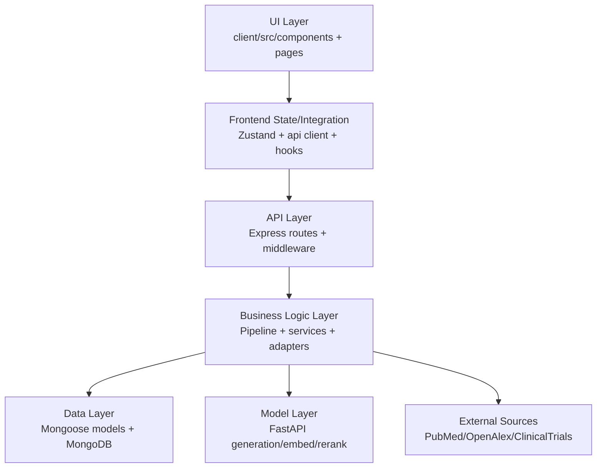
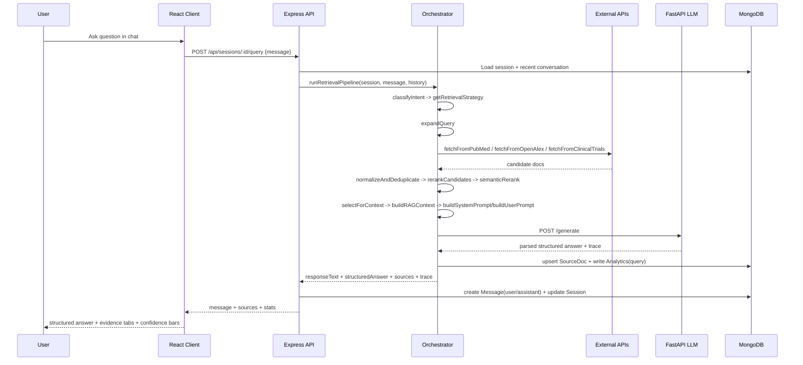
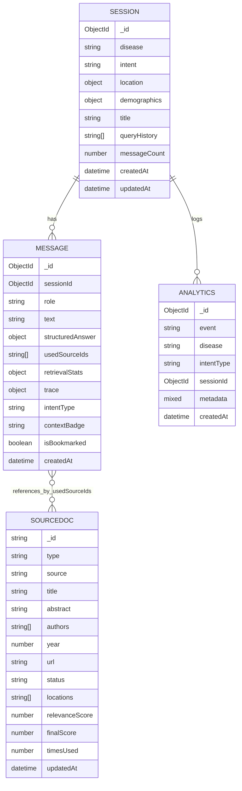

# Curalink

## 1. Project Overview

Curalink is an evidence-grounded medical research assistant that combines a React frontend, an Express retrieval API, and a FastAPI LLM service to answer disease-focused questions with explicit source traceability.

### What the project does

Curalink lets a user:

- Create a disease-centered research session with optional intent, demographics, and location context.
- Ask natural-language medical research questions in a chat workflow.
- Retrieve large candidate pools from PubMed, OpenAlex, and ClinicalTrials.gov.
- Normalize and rerank sources using a hybrid relevance/recency/location/credibility scoring pipeline.
- Generate structured answers with explicit citation IDs (for example, `P1`, `T1`) and confidence breakdown.
- Inspect evidence via dedicated publications, trials, researchers, and timeline panels.
- Bookmark assistant answers, search historical answers, export session payloads (PDF/JSON/CSV), and view analytics.

### Why it was built

The project addresses a common gap between:

- Generic LLM chat tools that can answer quickly but are not reliably source-traceable.
- Raw scientific interfaces (PubMed/OpenAlex/clinical trial registries) that are powerful but difficult for non-research users to navigate quickly.

Curalink was built to prioritize source-linked outputs, retrieval transparency, and session-oriented evidence exploration.

### Who it is for

- Patients and caregivers exploring disease-specific research updates.
- Clinical researchers and students who need fast, broad, multi-source triage.
- Product/demo environments where explainable AI + source traceability are core requirements.

## 2. Tech Stack & Why Each Was Chosen

### Application stack

| Technology | Where Used | What It Does Here | Why Chosen Over Alternatives |
|---|---|---|---|
| Node.js 20 | Root tooling + server runtime | Runs orchestration scripts and backend API | Mature ecosystem for API + tooling; easy monorepo scripting |
| Express 4 | `server/src/app.js`, routes | API routing, middleware, health/status endpoints | Lightweight, fast iteration, clear middleware pipeline |
| Mongoose 8 | `server/src/models/*.js` | Mongo schema modeling and query API | Schema validation + indexing + familiar ODM for Node |
| MongoDB Atlas | Session/message/source/analytics persistence | Stores sessions, chat messages, source docs, analytics events | Flexible document model fits mixed payloads (structured answer + trace metadata) |
| React 18 | `client/src` | UI layer for chat/evidence/analytics | Component ecosystem + routing + state tooling maturity |
| Vite 6 | Client build/dev server | Fast HMR and production build | Better startup/HMR speed than legacy CRA |
| Tailwind CSS v4 | `client/src/styles.css`, utility classes | Design-system-like tokenized styling and rapid UI layout | Faster iteration vs hand-authored component CSS across many views |
| Zustand | `client/src/store/*.js` | Global app and toast state | Smaller API surface than Redux for this scale |
| Axios | Client and server HTTP calls | Calls backend endpoints and external APIs | Clean interceptors/timeouts and predictable error handling |
| Recharts | Analytics + timeline views | Charts for activity/intent/source distributions | Easy React integration and composable chart components |
| FastAPI | `llm-service/main.py` and HF clone | LLM generation/embed/rerank/suggestions service | Async-ready, typed payloads, fast JSON APIs |
| Pydantic v2 | LLM request/response validation | Enforces schema for generation payloads | Strong runtime validation for structured JSON contracts |
| sentence-transformers | LLM service embedding path | Query/doc embedding for semantic cache + rerank | Good quality-speed balance for local embedding |
| Groq API | LLM generation provider option | Hosted model inference in production-like mode | Low-latency hosted inference without self-hosting full model stack |
| Ollama | Local model provider option | Local chat + local embedding fallback path | Offline/local dev path and controllable local model runtime |
| LangGraph + LangChain Core | Optional generation workflow mode | Node-based generation flow (`prepare -> generate -> parse -> fallback`) | Explicit staged orchestration and recoverable flow control |
| node-cron | Backend scheduler | Periodic analytics snapshots | Minimal dependency for cron-like scheduling |
| Winston | Backend logging | Structured app/service logs to console + files | Better production observability than plain `console` |
| xml2js | PubMed adapter | Parses XML efetch payloads | Needed for NCBI XML response format |
| jsPDF | Frontend dependency set | Client-side PDF support (complementary to backend export) | Browser-native export path when needed |

### Infrastructure and runtime/tooling

| Tool | Role |
|---|---|
| `concurrently` | Root `start.js` process orchestration (client + server + llm-service) |
| Docker | Container definitions for `llm-service` and `hf-space-curalink-llm` |
| Render (`render.yaml`) | Multi-service deployment spec (API + LLM) |
| Vite proxy | Local same-origin dev API proxy to avoid CORS complexity |

## 3. High-Level Architecture Diagram

```mermaid
flowchart LR
  U[User Browser]

  subgraph FE[Frontend - React/Vite]
    LP[LandingPage]
    RI[ResearchInterface]
    AD[Analytics]
    ST[Zustand Stores]
  end

  subgraph API[Backend - Express/Mongoose]
    RT[Route Layer]
    ORCH[Retrieval Orchestrator]
    APIS[Source Adapters]
    EXP[Export Service]
    ANA[Analytics Service]
    CACHE[Query + Insights Caches]
  end

  subgraph DB[MongoDB Atlas]
    S[(sessions)]
    M[(messages)]
    SD[(sourcedocs)]
    A[(analytics)]
  end

  subgraph LLM[FastAPI LLM Service]
    GEN[/generate]
    EMB[/embed]
    RR[/rerank]
    SUG[/suggestions]
    SEM[Semantic Cache]
  end

  subgraph EXT[External Research APIs]
    PM[PubMed E-utilities]
    OA[OpenAlex Works API]
    CT[ClinicalTrials.gov v2]
  end

  U --> FE
  FE -->|/api/*| API
  API -->|HTTP| LLM
  API -->|fetch candidates| EXT
  API --> DB
  LLM -->|provider chain| Groq[(Groq)]
  LLM -->|optional local| Ollama[(Ollama)]
```

## 4. Layer-by-Layer Breakdown



### UI layer

- Purpose: user interaction, evidence visualization, analytics presentation.
- Modules:
  - Pages: `LandingPage`, `ResearchInterface`, `Analytics`, `AnalyticsDashboard`.
  - Feature components: chat, evidence tabs, bookmarks, export menu, command palette, status banners.
- Technologies: React, React Router, Tailwind, Recharts, lucide icons.
- Connection to next layer: calls API client functions in `client/src/utils/api.js` and updates Zustand stores.

### Frontend state and integration layer

- Purpose: normalize client-side app state and manage API call behavior.
- Modules:
  - `client/src/store/useAppStore.js`
  - `client/src/store/useToastStore.js`
  - `client/src/utils/api.js`
  - `client/src/hooks/useTheme.js`
- Technologies: Zustand, Axios.
- Connection to next layer: invokes backend routes (`/sessions`, `/analytics/*`, `/health`, `/bookmarks`, etc).

### API layer

- Purpose: request validation, route contracts, middleware policy and health/status exposure.
- Modules:
  - `server/src/app.js`
  - `server/src/routes/query.js`
  - `server/src/routes/sessions.js`
  - `server/src/routes/analytics.js`
  - `server/src/routes/export.js`
  - middleware: compression, error handler, request/insights cache.
- Technologies: Express, helmet, cors, morgan, rate-limit.
- Connection to next layer: invokes orchestrator/services and returns normalized payloads to frontend.

### Business logic layer

- Purpose: retrieval pipeline, scoring, context packaging, LLM calls, exports, analytics rollups.
- Modules:
  - Pipeline: `intentClassifier`, `queryExpander`, `normalizer`, `reranker`, `contextPackager`, `orchestrator`.
  - API adapters: `pubmed`, `openalex`, `clinicaltrials`.
  - Services: `llm`, `analyticsService`, `export`, `scheduler`, `sessionInsights`, query/insights cache.
- Technologies: Axios, custom scoring, semantic rerank delegation.
- Connection to next layer: persists results via Mongoose models and calls FastAPI LLM service.

### Data layer

- Purpose: durable session history, source reuse, and analytics metrics.
- Modules:
  - `Session`, `Message`, `SourceDoc`, `Analytics` schemas.
- Technologies: Mongoose + MongoDB.
- Connection to next layer: backend reads/writes model documents and aggregates for analytics.

### Model service layer

- Purpose: generation pipeline, robust JSON parsing/normalization, embeddings/reranking, suggestions.
- Modules:
  - `llm-service/main.py`
  - `llm-service/cache/semantic_cache.py`
- Technologies: FastAPI, Pydantic, sentence-transformers, optional Groq/Ollama + LangGraph.
- Connection to next layer: calls external model providers and returns structured outputs to backend.

## 5. Data Flow (End-to-End)



### Concrete backend function path for a query

1. `client/src/components/chat/ChatPanel.jsx` -> `handleSend()`.
2. `client/src/utils/api.js` -> `api.post(/sessions/:id/query)`.
3. `server/src/routes/query.js` -> `POST /sessions/:id/query`.
4. `server/src/services/pipeline/orchestrator.js` -> `runRetrievalPipeline()`.
5. Pipeline internals:
   - `classifyIntent()` and `getRetrievalStrategy()`.
   - `expandQuery()`.
   - `fetchFromPubMed()`, `fetchFromOpenAlex()`, `fetchFromClinicalTrials()`.
   - `normalizeAndDeduplicate()`.
   - `rerankCandidates()`, `semanticRerank()`.
   - `selectForContext()`, `computeEvidenceStrength()`.
   - `buildRAGContext()`, `buildSystemPrompt()`, `buildUserPrompt()`.
   - `callLLM()` and `parseLLMResponse()`.
6. Persistence and response:
   - `SourceDoc.bulkWrite(...)` in orchestrator.
   - `Message.create(...)` + `Session.findByIdAndUpdate(...)` in route.
   - returns assistant message payload + source panel payload + trace metrics.

## 6. Directory Structure

> Annotated source/config tree (codebase-focused). Runtime-generated caches and large machine outputs are grouped with wildcards where repetitive.

```text
Curalink/
|-- .env.example                         # Root-level sample env values for local defaults.
|-- .gitignore                           # Ignore rules for Node, Python, logs, and generated artifacts.
|-- components.json                      # shadcn/ui component generator configuration.
|-- DAY1_IMPLEMENTATION.md               # Legacy implementation planning doc (historical).
|-- DAY2_IMPLEMENTATION.md               # Legacy implementation planning doc (historical).
|-- DAY3_IMPLEMENTATION.md               # Legacy implementation planning doc (historical).
|-- DAY4_IMPLEMENTATION.md               # Legacy implementation planning doc (historical).
|-- integration-smoke.mjs                # Root proxy that executes scripts/integration-smoke.mjs.
|-- main.py                              # Root ASGI compatibility entrypoint forwarding to llm-service/main.py.
|-- package.json                         # Root scripts orchestrating checks/startup across services.
|-- package-lock.json                    # Root lockfile.
|-- PRD (1).md                           # Product requirements and architecture intent doc.
|-- PROJECT_CONTEXT.json                 # Generated machine-readable project context snapshot.
|-- PROJECT_CONTEXT.md                   # Generated human-readable project context snapshot.
|-- README.md                            # This documentation.
|-- render.yaml                          # Render deployment spec for API and LLM services.
|-- start.js                             # Multi-service startup orchestrator with dynamic port selection.
|-- TODO.md                              # Legacy audit TODO notes.
|
|-- .github/
|  `-- agents/
|     |-- prd-backend-pipeline.agent.md      # Backend implementation agent instructions.
|     |-- prd-frontend-experience.agent.md   # Frontend implementation agent instructions.
|     |-- prd-llm-rag.agent.md               # LLM/RAG implementation agent instructions.
|     |-- prd-sync-orchestrator.agent.md     # Cross-layer orchestration guidance.
|     `-- prd-validation-sync.agent.md       # Validation and synchronization guidance.
|
|-- .superdesign/
|  |-- SUPERDESIGN.md                    # Superdesign workflow operating guide.
|  |-- design-system.md                  # Design-system synthesis for UI generation workflows.
|  `-- init/
|     |-- components.md                  # Precomputed component inventory.
|     |-- extractable-components.md      # Candidate reusable extracted components.
|     |-- layouts.md                     # Layout-level source analysis snapshot.
|     |-- pages.md                       # Page dependency map snapshot.
|     |-- routes.md                      # Route inventory snapshot.
|     `-- theme.md                       # Theme/token summary snapshot.
|
|-- client/
|  |-- .env.example                      # Frontend local env defaults.
|  |-- .env.production                   # Frontend production API endpoint defaults.
|  |-- index.html                        # Vite entry HTML.
|  |-- package.json                      # Frontend scripts and dependencies.
|  |-- package-lock.json                 # Frontend lockfile.
|  |-- tailwind.config.js                # Tailwind content paths/config.
|  |-- vite.config.js                    # Vite plugins, aliases, and /api proxy.
|  |-- public/
|  |  |-- favicon.ico                    # Browser favicon.
|  |  `-- favicon.svg                    # SVG app icon.
|  `-- src/
|     |-- App.jsx                        # Route registration and suspense shell.
|     |-- main.jsx                       # React app bootstrap and BrowserRouter mount.
|     |-- styles.css                     # Global design tokens and utility surface classes.
|     |-- components/
|     |  |-- ContextForm.jsx                     # Session context creation form component.
|     |  |-- analytics/
|     |  |  |-- AnalyticsBadge.jsx               # Analytics status/label badge UI.
|     |  |  |-- AnalyticsCard.jsx                # Generic analytics card container.
|     |  |  |-- AnalyticsChartsTabs.jsx          # Tabbed analytics chart section.
|     |  |  |-- AnalyticsLoadingSkeleton.jsx     # Loading skeleton variant for analytics.
|     |  |  |-- AnalyticsMetricCard.jsx          # Metric tile with accent styling.
|     |  |  |-- AnalyticsSkeleton.jsx            # Composite analytics loading state.
|     |  |  |-- AnalyticsStateNotice.jsx         # Empty/error state notice block.
|     |  |  |-- AnalyticsTabs.jsx                # Analytics view tab control.
|     |  |  |-- OverviewCharts.jsx               # Overview chart composition helper.
|     |  |  |-- OverviewMetrics.jsx              # Overview metrics composition helper.
|     |  |  |-- SessionBreakdownPanel.jsx        # Session-level analytics drilldown panel.
|     |  |  `-- SystemStatusWidget.jsx           # Health/status widget with polling.
|     |  |-- chat/
|     |  |  |-- ChatInput.jsx                    # Input box with suggestions/autoresize.
|     |  |  |-- ChatPanel.jsx                    # Chat orchestration and send flow.
|     |  |  |-- MessageBubble.jsx                # Per-message rendering + bookmark/citation helpers.
|     |  |  `-- StructuredAnswer.jsx             # Structured answer block renderer.
|     |  |-- evidence/
|     |  |  |-- EvidencePanel.jsx                # Tabbed evidence container.
|     |  |  |-- PublicationsTab.jsx              # Publication cards, search, and pagination.
|     |  |  |-- ResearchersTab.jsx               # Author aggregation and spotlight list.
|     |  |  |-- TimelineTab.jsx                  # Conversation timeline panel.
|     |  |  `-- TrialsTab.jsx                    # Clinical trial cards and metadata.
|     |  |-- features/
|     |  |  |-- BookmarksPanel.jsx               # Global bookmark list grouped by session.
|     |  |  |-- BookmarkToggle.jsx               # Toggle bookmark API action.
|     |  |  |-- EvidenceConfidenceBars.jsx       # Confidence metric bar visualization.
|     |  |  |-- EvidenceConfidenceHeatmap.jsx    # Confidence table/heatmap for sources.
|     |  |  |-- HistoryCommandPalette.jsx        # Keyboard-driven history search modal.
|     |  |  |-- SessionExportMenu.jsx            # Export trigger and progress UX.
|     |  |  `-- SystemStatusBanner.jsx           # Global API/DB/LLM status banner.
|     |  |-- layout/
|     |  |  `-- AppTopNav.jsx                    # Top navigation/header wrapper.
|     |  |-- sidebar/
|     |  |  |-- ExportButton.jsx                 # Sidebar export action button.
|     |  |  `-- Sidebar.jsx                      # Session metadata/retrieval/sidebar controls.
|     |  `-- ui/
|     |     |-- Button.jsx                       # Variant button primitive.
|     |     |-- Card.jsx                         # Variant card primitive.
|     |     |-- ErrorBanner.jsx                  # Error toast/banner primitive.
|     |     |-- LoadingOverlay.jsx               # Overlay loading scaffold.
|     |     |-- ThemeToggle.jsx                  # Theme mode switch UI.
|     |     |-- ToastViewport.jsx                # App-wide toast stack renderer.
|     |     `-- textarea.jsx                     # Styled textarea primitive.
|     |-- hooks/
|     |  `-- useTheme.js                         # Theme mode hook + persistence.
|     |-- lib/
|     |  `-- utils.js                            # `cn`, `clamp`, keyboard helpers.
|     |-- pages/
|     |  |-- Analytics.jsx                       # Current analytics dashboard route.
|     |  |-- AnalyticsDashboard.jsx              # Legacy/alternate analytics dashboard route.
|     |  |-- LandingPage.jsx                     # Session creation and launch page.
|     |  `-- ResearchInterface.jsx               # Main research workspace route.
|     |-- store/
|     |  |-- useAppStore.js                      # Main app/session/message/source store.
|     |  `-- useToastStore.js                    # Toast state store and helper actions.
|     `-- utils/
|        `-- api.js                              # Axios API client with fallback and health cache.
|
|-- server/
|  |-- .env                                # Local development env (contains secrets; do not commit).
|  |-- .env.example                        # Backend env template with required settings.
|  |-- .node-version                       # Node runtime version pin for backend.
|  |-- package.json                        # Backend scripts/dependencies.
|  |-- package-lock.json                   # Backend lockfile.
|  |-- logs/
|  |  |-- combined.log                     # Aggregated backend logs (runtime artifact).
|  |  `-- error.log                        # Error backend logs (runtime artifact).
|  `-- src/
|     |-- app.js                           # Express boot, health endpoints, Mongo connect, scheduler start.
|     |-- lib/
|     |  `-- logger.js                     # Winston logger configuration.
|     |-- middleware/
|     |  |-- errorHandler.js               # Error mapping middleware.
|     |  |-- gzipCompression.js            # Custom JSON gzip middleware.
|     |  |-- insightsCache.js              # Request-level insights response cache middleware.
|     |  `-- requestLogger.js              # Request timing logger middleware.
|     |-- models/
|     |  |-- Analytics.js                  # Analytics event schema.
|     |  |-- Message.js                    # Message and structured answer schema.
|     |  |-- Session.js                    # Session metadata schema.
|     |  `-- SourceDoc.js                  # Normalized source document schema.
|     |-- routes/
|     |  |-- analytics.js                  # Analytics endpoints.
|     |  |-- export.js                     # Session export endpoint.
|     |  |-- query.js                      # Query + suggestion endpoints.
|     |  `-- sessions.js                   # Session CRUD, bookmarks, insights, source retrieval.
|     `-- services/
|        |-- analyticsService.js           # Aggregated analytics computations.
|        |-- export.js                     # JSON/CSV/PDF export construction.
|        |-- healthContract.js             # Health response normalization patch.
|        |-- insightsCache.js              # LRU-like insights cache helpers.
|        |-- llm.js                        # Backend client for FastAPI LLM calls.
|        |-- queryResultCache.js           # Per-session query response cache.
|        |-- scheduler.js                  # Cron snapshot scheduler.
|        |-- sessionInsights.js            # Insights payload/latency/source utility functions.
|        |-- apis/
|        |  |-- clinicaltrials.js          # ClinicalTrials.gov adapter.
|        |  |-- openalex.js                # OpenAlex adapter.
|        |  `-- pubmed.js                  # PubMed adapter.
|        `-- pipeline/
|           |-- contextPackager.js         # Prompt context and system/user prompt builders.
|           |-- intentClassifier.js        # Intent heuristics and retrieval strategy map.
|           |-- normalizer.js              # Candidate normalization and deduplication.
|           |-- orchestrator.js            # End-to-end retrieval + LLM orchestration.
|           |-- queryExpander.js           # Disease/intent query expansion logic.
|           |-- reranker.js                # Candidate scoring and context selection.
|           `-- retriever.js               # Placeholder retriever (currently unused by orchestrator).
|
|-- llm-service/
|  |-- .python-version                     # Python version pin.
|  |-- Dockerfile                          # LLM service container image build.
|  |-- main.py                             # FastAPI app for health/generate/embed/rerank/suggestions.
|  |-- requirements.txt                    # Python dependency lock/pin list.
|  |-- start.sh                            # Runtime start script (provider detection + uvicorn).
|  `-- cache/
|     |-- __init__.py                      # Cache module exports.
|     `-- semantic_cache.py                # Semantic LRU cache implementation.
|
|-- hf-space-curalink-llm/
|  |-- .gitattributes                      # Git LFS patterns for model/binary artifacts.
|  |-- Dockerfile                          # Hugging Face Space container spec.
|  |-- main.py                             # HF-space LLM service entry (mirrors llm-service).
|  |-- README.md                           # HF Space metadata card.
|  |-- requirements.txt                    # HF Space Python dependencies.
|  `-- start.sh                            # HF Space startup script.
|
|-- scripts/
|  |-- generate-project-context.mjs        # Context generator (routes/env/tree/dependency snapshot).
|  |-- integration-smoke.mjs               # Full integration smoke test runner (spawns services).
|  `-- latency-bench.mjs                   # Latency benchmark runner + report writer.
|
|-- logs/                                  # Root log output directory (runtime artifact).
|
`-- graphify-out/
   |-- GRAPH_REPORT.md                     # Graphify report output.
   |-- graph.html                          # Graph visualization artifact.
   |-- graph.json                          # Graph data artifact.
   |-- manifest.json                       # Graphify run manifest.
   |-- cost.json                           # Graphify token/cost metrics artifact.
   |-- memory-map-*.json                   # Graphify memory map snapshots.
   |-- latency-bench-*.json                # Latency benchmark snapshots.
   |-- .graphify_chunk_*.json              # Chunked graph intermediate files.
   |-- cache/*.json                        # Graphify cache objects (large generated set).
   `-- memory/*.md                         # Graphify memory notes.
```

## 7. Key Functions & Modules

### Backend API and route functions

| Function/Module | Location | Purpose | Inputs | Outputs | Role in Flow |
|---|---|---|---|---|---|
| `startServer` | `server/src/app.js` | Connect DB, start HTTP server, initialize scheduler | optional `port` | active HTTP server | Entry point for backend runtime |
| `connectMongoAtlasStrict` | `server/src/app.js` | Atlas-first connection attempt with fallback URI support | env URIs + options | connected mongoose state or throw | Hard-gates API availability |
| `healthHandler` | `server/src/app.js` | Unified health payload with DB + LLM status | request | health JSON | Polled by frontend system widgets |
| `POST /sessions/:id/query` handler | `server/src/routes/query.js` | Main query execution route | session id + user message | assistant message + sources + stats | Core chat pipeline entry |
| `GET /suggestions` handler | `server/src/routes/query.js` | Query suggestion service | partial query + session/history context | suggestion list | Powers autocomplete in landing/chat |
| `POST /sessions` handler | `server/src/routes/sessions.js` | Create research session | disease/intent/location/demographics | created session | Session bootstrap |
| `GET /sessions/:id` handler | `server/src/routes/sessions.js` | Load session + full messages | session id | session + ordered messages | Research page hydration |
| `GET /sessions/:id/sources` | `server/src/routes/sessions.js` | Fetch all or latest source documents | session id + mode | source list | Evidence panel hydration |
| `POST /sessions/:id/messages/:msgId/bookmark` | `server/src/routes/sessions.js` | Toggle assistant bookmark state | session/message id | bookmark state | Bookmark UX |
| `GET /bookmarks` | `server/src/routes/sessions.js` | Grouped bookmark listing by session | optional limit | grouped bookmarks | Sidebar/bookmark panel |
| `GET /analytics/overview` | `server/src/routes/analytics.js` | High-level dashboard metrics | optional query params | summary metrics object | Analytics home |
| `GET /sessions/:id/export` | `server/src/routes/export.js` | Session export in JSON/CSV/PDF | session id + `format` | downloadable payload | Export menu |

### Retrieval pipeline functions

| Function | Location | Purpose |
|---|---|---|
| `runRetrievalPipeline` | `server/src/services/pipeline/orchestrator.js` | Full retrieval + rerank + LLM + trace pipeline orchestration. |
| `classifyIntent` | `server/src/services/pipeline/intentClassifier.js` | Heuristic intent classification from query + context intent. |
| `getRetrievalStrategy` | `server/src/services/pipeline/intentClassifier.js` | Intent-to-strategy mapping controlling source/ranking behavior. |
| `expandQuery` | `server/src/services/pipeline/queryExpander.js` | Creates source-specific query variants (PubMed/OpenAlex/CT). |
| `fetchFromPubMed` | `server/src/services/apis/pubmed.js` | PubMed `esearch` + XML `efetch` retrieval adapter. |
| `fetchFromOpenAlex` | `server/src/services/apis/openalex.js` | OpenAlex works retrieval with dedupe and abstract reconstruction. |
| `fetchFromClinicalTrials` | `server/src/services/apis/clinicaltrials.js` | ClinicalTrials v2 retrieval with status/location/contact extraction. |
| `normalizeAndDeduplicate` | `server/src/services/pipeline/normalizer.js` | Unified source format normalization and duplicate filtering. |
| `rerankCandidates` | `server/src/services/pipeline/reranker.js` | Hybrid scoring (keyword + recency + location + credibility + boosts). |
| `selectForContext` | `server/src/services/pipeline/reranker.js` | Chooses bounded evidence set for LLM context packaging. |
| `computeEvidenceStrength` | `server/src/services/pipeline/reranker.js` | Computes `LIMITED/MODERATE/STRONG` label from evidence profile. |
| `buildRAGContext` | `server/src/services/pipeline/contextPackager.js` | Builds citation-indexed context text and source index map. |
| `buildSystemPrompt` | `server/src/services/pipeline/contextPackager.js` | Strict output contract prompt for source-cited JSON answer. |
| `buildUserPrompt` | `server/src/services/pipeline/contextPackager.js` | Injects profile/query/context into LLM prompt payload. |

### Backend support services

| Function/Module | Location | Purpose |
|---|---|---|
| `callLLM`, `generateSmartSuggestions`, `semanticRerank` | `server/src/services/llm.js` | Typed HTTP client bridge to FastAPI LLM service. |
| `parseLLMResponse` | `server/src/services/llm.js` | Resilient parser + schema normalization + citation-safe fallback. |
| `getCachedQueryResult` / `setCachedQueryResult` | `server/src/services/queryResultCache.js` | Session/query scoped response cache with TTL/LRU behavior. |
| `getAnalyticsOverview` and related methods | `server/src/services/analyticsService.js` | Aggregation-based analytics API payload builder. |
| `createSessionExportPayload`, `buildCsvExport`, `buildPdfExport` | `server/src/services/export.js` | Constructs export payloads and renders fallback-safe PDF. |
| `startAnalyticsScheduler` | `server/src/services/scheduler.js` | Cron-driven periodic `system_snapshot` analytics writes. |

### Frontend high-value modules

| Module | Location | Purpose |
|---|---|---|
| `useAppStore` | `client/src/store/useAppStore.js` | Central state for session, messages, selected sources, tab, errors. |
| `api` + `getSystemHealth` | `client/src/utils/api.js` | Backend API abstraction, retries/fallback, health cache. |
| `LandingPage` | `client/src/pages/LandingPage.jsx` | Session setup, suggestions, starter query launch. |
| `ResearchInterface` | `client/src/pages/ResearchInterface.jsx` | Main three-panel workspace + bootstrap/focus behavior. |
| `ChatPanel` + `ChatInput` | `client/src/components/chat` | Query dispatch, message rendering, suggestion-driven input UX. |
| `EvidencePanel` | `client/src/components/evidence/EvidencePanel.jsx` | Publications/trials/researchers/timeline tabs. |
| `BookmarksPanel` + `BookmarkToggle` | `client/src/components/features` | Bookmark persistence and grouped retrieval UX. |
| `SessionExportMenu` | `client/src/components/features/SessionExportMenu.jsx` | Download session exports by format. |
| `Analytics` | `client/src/pages/Analytics.jsx` | Overview + session drilldown visualization. |

### FastAPI LLM service key functions

| Function | Location | Purpose |
|---|---|---|
| `generate` | `llm-service/main.py` | Main generation endpoint with semantic cache + provider chain. |
| `embed` | `llm-service/main.py` | Text embedding endpoint with sentence-transformers/Ollama/hash fallback. |
| `rerank` | `llm-service/main.py` | Semantic reranking endpoint over document list. |
| `suggest` | `llm-service/main.py` | Query suggestion generation endpoint. |
| `invoke_provider_chain` | `llm-service/main.py` | Provider order resolution (`groq`/`ollama`/local fallback). |
| `ensure_structured_schema` | `llm-service/main.py` | Strict response schema normalization and citation filtering. |
| `extract_json` | `llm-service/main.py` | Robust JSON extraction from model text responses. |
| `lookup_semantic_cache` / `store_semantic_cache` | `llm-service/main.py` | In-memory semantic response cache read/write logic. |
| `SemanticLRUCache` | `llm-service/cache/semantic_cache.py` | Reusable similarity-aware LRU cache utility (module-level support). |

## 8. API Reference

### Backend API (`server`)

| Method | Path | Purpose | Request Body | Response Summary |
|---|---|---|---|---|
| GET | `/` | API root metadata | - | service/version/timestamp |
| GET | `/health` | Health alias | - | health payload |
| GET | `/api/health` | Primary health endpoint | - | status + services + uptime |
| POST | `/api/sessions` | Create session | `{ disease, intent, location, demographics }` | `{ session }` |
| GET | `/api/sessions` | Recent sessions list | - | `{ sessions[] }` |
| GET | `/api/sessions/:id` | Session + full message history | - | `{ session, messages[] }` |
| DELETE | `/api/sessions/:id` | Delete session + related records | - | `{ message }` |
| GET | `/api/sessions/:id/sources` | Session source docs | optional `mode=latest` | `{ sources[] }` |
| GET | `/api/sessions/:id/sources/:messageId` | Sources for assistant message | - | `{ messageId, sources[] }` |
| GET | `/api/sessions/:id/insights` | Structured insight payload | - | structured insights snapshot |
| POST | `/api/sessions/:id/query` | Execute retrieval + generation pipeline | `{ message }` | `{ message, sources, stats, evidenceStrength, sourceIndex, trace }` |
| GET | `/api/suggestions` | Query suggestions | `q`, `limit`, optional `sessionId` | `{ suggestions[] }` |
| GET | `/api/sessions/history/search` | Search message history | `q`, `limit` | `{ query, limit, results[] }` |
| POST | `/api/sessions/:id/messages/:msgId/bookmark` | Toggle bookmark | - | bookmark status payload |
| GET | `/api/bookmarks` | Grouped bookmarks | optional `limit` | `{ totalBookmarks, groups[] }` |
| GET | `/api/sessions/:id/export` | Export session | `format=pdf|json|csv` | download stream/payload |
| GET | `/api/analytics/overview` | Main analytics overview | `days`, `topIntentsLimit` | totals/latency/intents/activity |
| GET | `/api/analytics/sessions/:id/breakdown` | Session analytics | - | session-level breakdown |
| GET | `/api/analytics/top-diseases` | Disease ranking | optional `limit` | `{ diseases[] }` |
| GET | `/api/analytics/intent-breakdown` | Intent frequency | - | `{ intents[] }` |
| GET | `/api/analytics/source-stats` | Source distribution stats | - | `{ sources, total, distribution }` |
| GET | `/api/analytics/trial-status` | Trial status distribution | - | `{ statuses[] }` |
| GET | `/api/analytics/snapshots` | Scheduler snapshots | optional `limit` | `{ snapshots[] }` |

### LLM service API (`llm-service` and HF clone)

| Method | Path | Purpose | Request Body | Response Summary |
|---|---|---|---|---|
| GET | `/` | LLM service metadata | - | service/version/uptime |
| GET | `/health` | LLM health | - | status + llm service state |
| GET | `/api/health` | Health alias | - | status + llm service state |
| POST | `/generate` | Structured generation | `{ system_prompt, user_prompt, temperature, max_tokens }` | `text`, `parsed`, provider/model/trace |
| POST | `/embed` | Embeddings | `{ texts[] }` | embeddings + mode/model |
| POST | `/rerank` | Semantic rerank | `{ query, documents[], top_k }` | ranked ids/scores |
| POST | `/suggestions` | Suggestion generation | `{ partial_query, history[], common_topics[], limit }` | suggestion list |

## 9. Database / Data Models

### Data model diagram



### Why this structure

- `Session` captures stable user context and top-level conversation metadata.
- `Message` stores immutable conversational chronology and structured answer artifacts.
- `SourceDoc` stores normalized evidence entities independently so they can be reused, ranked, and tracked by usage frequency.
- `Analytics` keeps event-style append-only telemetry (query/export/session/system_snapshot), enabling both operational and product analytics without mutating session records.

### Important indexes

- `Session`: `updatedAt`, `createdAt`, and `{ disease, updatedAt }` for recent retrieval views.
- `Message`: `{ sessionId, createdAt }`, `{ sessionId, role, createdAt }`, bookmark index.
- `SourceDoc`: source/type/timesUsed indexes for analytics and recency queries.
- `Analytics`: event-first indexes and event+disease/event+intent composite indexes.

## 10. How It Works - Step-by-Step

1. User opens landing page and submits disease + optional context.
2. Frontend creates a session via `POST /api/sessions`.
3. User sends first message; frontend posts to `POST /api/sessions/:id/query`.
4. Backend validates session/message and loads recent history for follow-up context.
5. Pipeline classifies intent and builds source-specific query variants.
6. Backend fetches candidate pools from PubMed/OpenAlex/ClinicalTrials in parallel.
7. Results are normalized into a unified source shape and deduplicated.
8. Candidates are ranked by hybrid scoring; optional semantic reranking is applied unless skip threshold is met.
9. Context subset is selected for prompt budget and citation mapping.
10. Prompt packager emits strict system + user prompts with citation IDs.
11. Backend calls FastAPI `/generate`; service executes semantic cache lookup and provider workflow.
12. LLM output is parsed, schema-normalized, citation-validated, and fallback-corrected when needed.
13. Backend upserts selected source docs and records analytics query event.
14. Backend persists user+assistant messages and session query history.
15. Frontend receives assistant payload, updates store, and renders structured answer + evidence panels.
16. Optional user actions (bookmark/export/analytics/history search) hit dedicated backend routes and consume existing stored artifacts.

## 11. Setup & Installation

### Prerequisites

- Node.js 20.x (root and backend scripts).
- Python 3.11.x (LLM services).
- MongoDB Atlas connection string.
- Optional: Ollama runtime for local provider mode.
- Optional: Groq API key for hosted generation mode.

### Install dependencies

```bash
npm install
npm --prefix client install
npm --prefix server install
pip install -r llm-service/requirements.txt
```

### Recommended quick start

```bash
npm run start:all
```

This starts:

- `llm-service` via `uvicorn` (port auto-resolved from `LLM_PORT` base).
- backend server (`server` package `dev` script).
- Vite client (`client` package `dev` script).

### Visual editing with React Rewrite

You can visually edit React UI and write confirmed changes back to source files while the Vite dev server is running.

From workspace root:

```bash
npm run rewrite
```

From `client/` directly:

```bash
npm run rewrite
```

Useful variants:

```bash
npm run rewrite:no-open
npm run rewrite -- --verbose
npm run rewrite -- 5173
```

Requirements:

- Run against a development server, not a production build.
- Start from the React app root (`client/`) if running the CLI directly (`npx react-rewrite`).
- Node.js 20+.

### Manual start (3 terminals)

LLM service:

```bash
cd llm-service
PRIMARY_LLM_PROVIDER=groq GROQ_API_KEY=<key> python -m uvicorn main:app --app-dir . --host 127.0.0.1 --port 8001
```

Backend:

```bash
cd server
LLM_SERVICE_URL=http://127.0.0.1:8001 npm run dev
```

Frontend:

```bash
cd client
npm run dev -- --host 0.0.0.0 --port 5173
```

### Verification commands

```bash
npm run check:server
npm run check:client
npm run check:llm
node scripts/integration-smoke.mjs
```

## 12. Configuration

### Root-level scripts and config

| File | What It Controls |
|---|---|
| `package.json` | Monorepo orchestration scripts (`start:all`, `doctor`, checks). |
| `start.js` | Dynamic port allocation, provider env forwarding, multi-service process control. |
| `render.yaml` | Render service definitions (curalink-api and curalink-llm) and env wiring. |
| `.env.example` | Local environment baseline examples. |

### Backend environment variables (`server/.env.example`)

| Variable | Purpose |
|---|---|
| `MONGODB_URI` | Primary MongoDB connection URI (required). |
| `MONGODB_URI_FALLBACK` | Optional fallback URI when primary SRV path fails in some environments. |
| `LLM_SERVICE_URL` | Backend-to-LLM service base URL. |
| `FRONTEND_URL` | Comma-separated CORS allowlist origins. |
| `PORT` | Backend listen port. |
| `NODE_ENV` | Runtime mode. |
| `APP_VERSION` | Version value in health payloads. |
| `TRUST_PROXY` | Express proxy trust setting. |
| `PUBMED_EMAIL` | Polite identifier for PubMed requests. |
| `MONGODB_*_TIMEOUT/MS/POOL` vars | Mongo client timeout/pool tuning knobs. |
| `QUERY_CACHE_TTL_MS`, `QUERY_CACHE_MAX_ENTRIES` | Query response cache behavior. |
| `LLM_KEEP_ALIVE_MS`, `LLM_MAX_SOCKETS` | HTTP keep-alive settings for LLM client. |
| `ANALYTICS_SCHEDULER_ENABLED`, `ANALYTICS_SNAPSHOT_CRON` | Snapshot scheduler enablement/frequency. |

### Frontend environment variables

| Variable | File | Purpose |
|---|---|---|
| `VITE_APP_NAME` | `client/.env.example` | UI branding label. |
| `VITE_API_URL` | `client/.env.example`, `client/.env.production` | API base URL resolution in `api.js`. |
| `VITE_DEV_API_PROXY` | optional at runtime | Vite `/api` proxy target in local development. |

### LLM service environment variables

| Variable | Purpose |
|---|---|
| `PRIMARY_LLM_PROVIDER` | Chooses provider order (`groq` or `ollama`). |
| `GROQ_API_KEY`, `GROQ_MODEL` | Hosted provider credentials/model. |
| `OLLAMA_URL`, `OLLAMA_MODEL` | Local model endpoint/model. |
| `OLLAMA_EMBED_MODEL`, `OLLAMA_EMBED_TIMEOUT_SEC` | Ollama embedding fallback behavior. |
| `LOCAL_FALLBACK_ENABLED` | Enables local synthetic fallback when providers fail. |
| `FALLBACK_EMBED_DIM` | Hash embedding dimensionality. |
| `USE_LANGGRAPH_WORKFLOW` | Enables LangGraph state workflow path for generation. |
| `SEMANTIC_CACHE_THRESHOLD`, `SEMANTIC_CACHE_MAX_SIZE` | Generation semantic cache controls. |
| `LOCAL_EMBED_MODEL`, `EMBEDDING_BACKGROUND_WARMUP` | sentence-transformer loading behavior. |

## 13. Design Decisions & Trade-offs

### Major architectural decisions

1. **Strict source-grounded answer contract**
   - Decision: generation prompts enforce source IDs and structured JSON.
   - Benefit: traceability and safer evidence review.
   - Trade-off: stronger prompt constraints can reduce free-form fluency.

2. **Three-service split (frontend, API, LLM)**
   - Decision: keep model-serving concerns separate from retrieval API and UI.
   - Benefit: independent scaling/deployment and cleaner responsibility boundaries.
   - Trade-off: additional network hop and deployment complexity.

3. **Hybrid retrieval scoring + optional semantic rerank**
   - Decision: combine deterministic scoring with semantic rerank refinement.
   - Benefit: resilient baseline ranking even when semantic provider is degraded.
   - Trade-off: more moving parts and additional latency when semantic rerank is active.

4. **Atlas-first Mongo connection hard gate**
   - Decision: API returns `503` when DB disconnected (except health endpoints).
   - Benefit: avoids silent buffering and stale assumption failures.
   - Trade-off: stricter runtime dependency means reduced degraded-read capability.

5. **In-memory caches at both API and LLM tiers**
   - Decision: query cache, insights cache, semantic generation cache.
   - Benefit: improved repeated-query latency and lower provider load.
   - Trade-off: cache invalidation complexity and per-instance non-shared cache state.

### Known limitations and caveats

- `server/.env` currently contains a live secret value in repository workspace context. It should be rotated and removed from committed history for production hygiene.
- `server/src/routes/sessions.js` includes a duplicate `/ :id/insights` route definition shape where one block references undefined helpers (`buildSessionInsights`, imported cache helpers not wired in that scope). The first route implementation still serves insights, but this duplication is a maintainability and potential runtime-risk hotspot.
- `server/src/routes/sessions.js` uses `logger.error(...)` in analytics logging path without a corresponding import in the file, which can fail when that catch path executes.
- `server/src/services/pipeline/retriever.js` is currently a placeholder and not part of the active orchestration path.
- `hf-space-curalink-llm/main.py` mirrors `llm-service/main.py`, which introduces duplication risk if one is changed without syncing the other.

### Operational trade-offs

- **Provider flexibility vs deterministic output**: multi-provider fallback increases availability but adds variability in output shape quality, requiring heavy normalization.
- **Large candidate retrieval vs latency**: high fetch limits improve coverage but increase total response time and pressure on external APIs.
- **Rich frontend features vs complexity**: bookmarks/history/export/analytics improve UX but increase route/store/component coupling.

---

## Additional Notes

- Use `npm run doctor` as the default pre-commit health check to regenerate context and run all core checks.
- Runtime-generated directories (`logs`, `graphify-out`) can grow quickly; treat them as artifacts, not source of truth.
- For production, prefer secret injection through platform env settings (Render/HF Space), not checked-in `.env` files.

## Appendix B - Graphify Artifact Inventory (One-by-One)

Generated from the live workspace at document update time:

- graphify-out/.graphify_chunk_01.json
- graphify-out/.graphify_chunk_02.json
- graphify-out/.graphify_chunk_03.json
- graphify-out/.graphify_chunk_04.json
- graphify-out/.graphify_chunk_05.json
- graphify-out/cache/0697142d2151c95b8db9f1d70bcfb540deb6323f6bcbfbe9ba069f4d85b6d890.json
- graphify-out/cache/11dcd66dfb213d67018a648163170b32fb309ecd570abd15576ea2a7b20481ef.json
- graphify-out/cache/12678eb1e91ab6aed3a2cdeab07dbc67d141ea359efd8d3e1a95ab164193d953.json
- graphify-out/cache/135d589b30a2760dbd7e574a8204826da5bb6858c04c458f9871d0c15d6ced76.json
- graphify-out/cache/14304f61deff944076da8a2fea6e551c55c4b8394917f688609b76a91f6a86b7.json
- graphify-out/cache/14ac2ae68dac533939f500e75ba6da95548e18c0d705965b38a806a3a691e3be.json
- graphify-out/cache/17639e0b369ef7dfe8b40405bf42d2e018cdbe35b6f819340cf0b912e7924ac3.json
- graphify-out/cache/1a3cd671cf58d2f066ecc65807c7bdcc562d2e4688c0b34841e449fa65cea5ee.json
- graphify-out/cache/1ec277d72c0acb69aa3c0083ac3cdc1ad2e519604d8b4509885cb2434c0178e2.json
- graphify-out/cache/201b7b80dd593e1180d4c4e2d3022dec6651e0d3d9f27aea78427d084bc06178.json
- graphify-out/cache/212bd57c8a2b051187e441f17ebcb03fe46cac7cd0b3a0f8a75cf6a8c16a052e.json
- graphify-out/cache/21dc8550708fda8aeb73904270e16e54a8a414f103603d4935082792082fffc5.json
- graphify-out/cache/2477a9820619626b308ce83ce9e83b7121879dc92c9fa6b3397897cac85b0473.json
- graphify-out/cache/26c43b598aef99cdc72d6e649c8e30440af24c257651d05fe3e6a8e50161ce2e.json
- graphify-out/cache/2a79f0dccfd312c669c7decbad3f76ebbda5b01aec2b2bd91ff9df8bf01df968.json
- graphify-out/cache/2dca89b0b8a8743de6ddea2c1f8cbccb1e2b2aa1d6d2d110e3aa108bb69cad24.json
- graphify-out/cache/2e69a7dcb55c215cdf9309201f3facfc624318449d4122d8995069e830666e39.json
- graphify-out/cache/2fae11f6f79cead61651be61786c74e768b53f2f165a70259dbb04a930568b76.json
- graphify-out/cache/307623338a731cac6d1cd2e536fce5f5a49b00ae698f198c16025a9aaf4e89ef.json
- graphify-out/cache/322e05e71c046a2d18e0d4d641fda6a5db4434215ec3d96ec37df79d1614ce64.json
- graphify-out/cache/367be278d8c98211905403c44b6548f1b3c539fcfd8439082a9998a3dc872dc6.json
- graphify-out/cache/36e1ab1a21a6194b01e26424ea9f005c00804abd78476787c1edd50247817485.json
- graphify-out/cache/3bc7a5097dacc2b6045559f982c673902d679942f7815360e10115ba9c126a33.json
- graphify-out/cache/3e93e838f2ace86b3b194bfd5dd90e7b1ebc8e6946be3fa30e7ce1486ed0544c.json
- graphify-out/cache/49c2612d126100b28c8aee8dad22b2231fd2b145a8fcf4b5503401ddd89dd7bf.json
- graphify-out/cache/4cb918f227690a8447a104df1b5a1959cdf551f92dcb68f45140309eb4f9a71f.json
- graphify-out/cache/4d2f83e6175d20d106d51bd244ef6c071cf739160cbaf889c8a4bb0eb750bdb2.json
- graphify-out/cache/57b4ff68f6caca9439247200179bccb7e706968e10d67403cc5d5e202e287f93.json
- graphify-out/cache/5e923257de803b020d4d27341b8e301c67fc1d69fc1cabc33693121090ab3947.json
- graphify-out/cache/60848fe667dd2135fd60585226093fe711b55f88c1b8188dc7374961d7744f4e.json
- graphify-out/cache/677e523bd8cd0bddef3925b5b784c963217bdea8ec91cd207a27d0562b7e9f91.json
- graphify-out/cache/6934d7f313fa58f5ab380ef76c35a9db46c6ccdf6057981feb63509c65080aba.json
- graphify-out/cache/69a634c88b47b8038ee531b32571a58b6a8090d7b17c2693007c9b8e75af9e3b.json
- graphify-out/cache/6f083212563a48179b92f8299e3809f02e9a0834955c608f6b5a1d313f3e0d77.json
- graphify-out/cache/732e2ce1ae7187ee15aff2c214657f1f6d1115507afddd28fb39365e98e11ad0.json
- graphify-out/cache/74c7aae464913b22e9a7b7ab5b05476cc6f5af2b18f707ef3c46f9bd5e039f21.json
- graphify-out/cache/7615e82a9a63b12efea9206bc27ccb446d898687dda94c3bcd94f932f522b40d.json
- graphify-out/cache/762c32f5754663a4177fff0ae099f244240fc0e6db3d9018a16851143e20faf4.json
- graphify-out/cache/7ce858c2c3ebf97a5eb287dd5eb75694d2caada716523c42387653422c5dde33.json
- graphify-out/cache/7d6836ca94ffba06217872429cc03f5f65dff0b734bf6cd3c8a6f49b2698673e.json
- graphify-out/cache/8c1ff6a7e6808ef1d4dd8f37741e086383d9083b2aa7f1da3173a02b197b29bb.json
- graphify-out/cache/8d573b702e741ddb0c48dc4b64e0995242a8fd750b222c5526430a5e12e4778a.json
- graphify-out/cache/93c8cca9f70956cdbf5864a5f60e6719c651d2534ff1b70895dc584d3c0920cf.json
- graphify-out/cache/99feeecdb0470d5a9b78a93802f48b9353433c5fc042c95ebfb87726a4c38719.json
- graphify-out/cache/9de9bbaf898284982bcea856e6eff656bca6e0e3f51117c56a38a51a438eba32.json
- graphify-out/cache/9e45752675ad01f6bc4a7dacfd4cdf6749b10b3020391b107b62ad77a068cd82.json
- graphify-out/cache/9ec6118f57f88258bd0e1a68f1cbf9dd476caf91022bd0515a6f1eb1ebf73201.json
- graphify-out/cache/ae2aec8e3b88f58f009e1b0e1963368db9daf7943a7b97b81610122333abf481.json
- graphify-out/cache/aea46d239664934796996f286587f2217f2861d4ecd6f25a1476dd149ab68f1c.json
- graphify-out/cache/b2a8f12dc28bc4f9a616d90cd92346b235b1693fdc31957b4dae18b8184888e1.json
- graphify-out/cache/b62151ac293d84127d7eefa04b6d4a510480ccee26c73205bed8f4796bf3d7c9.json
- graphify-out/cache/b8143e17062edc773a31c949103643a7f6e7009618e7eea018f00c57dad46747.json
- graphify-out/cache/b94263a8f75b83ded1c6181b9459633c20bb4c7f04afd0ed8d595353159a45be.json
- graphify-out/cache/b971d1a0a230561d8ffc67dbb02de01bce28ff279b5d2745c02bbdf278cad447.json
- graphify-out/cache/ba3357ea509e8d177543eab31990af858cd998236a42c176c2050c1a7a2f42ae.json
- graphify-out/cache/baa46624e55c12656c8acfc836646c311439cee2f3e168108cb311457f5edc99.json
- graphify-out/cache/c4a34502077d9bf6e2b772e3ae880b171daeb9142521b6d84e5a2620e244c549.json
- graphify-out/cache/c537759fa6dc7ae78ac27f894f92f5bcdfe27ea1a56b0c3859fda5eb8c589858.json
- graphify-out/cache/c5930f426fe067d1d59187d5497d0a70edb44dc367bb1dd33cca16df2ebacfad.json
- graphify-out/cache/cbb525e818d5120b3e61b2a53ffc25d4591f758250f809995ead77e44c89b130.json
- graphify-out/cache/ccf27928d3c34967a8dfe7194c53e4a405f040cfdc0c96507b602438b3bd0ebd.json
- graphify-out/cache/cd4df35a4dd6fbc29b37f80160d5bbff1128921f0d11a871ea399e753a423757.json
- graphify-out/cache/ce04cb680e922713cea55a4721ce78b428bd0a61e5d13552cbd85bb0b54c4311.json
- graphify-out/cache/d47d12dbaa86207a5a31331e53131e702005df8ce269816ad8e885d61dfad754.json
- graphify-out/cache/d52141ff8c0765660f599ae16d4a6f9392f61de7c911f764a484973b540e1166.json
- graphify-out/cache/da4a4dabe3211f3ce73202f63cddffc06b00470499cf35e6f2df5b7888ec7d85.json
- graphify-out/cache/dd9e5a51e52cc89b9bdabb056494bc44160f30076799c4414a82f802862d2b1b.json
- graphify-out/cache/de5bc15cf1541a388db4e444d73b8700c4f51458e2df1e50e3ebc2351a451771.json
- graphify-out/cache/e2944ba5253f6d46f60d9d88e24c3f7c4c4e0cf57f730616b64993de85ec010c.json
- graphify-out/cache/e4ef45b6e2ed66ede581cc0d9c1334e0666fe0941b1a037b001f409c7eccee3c.json
- graphify-out/cache/e5c9599a6bb7c8b1fed2713f190b531fad937ff67eda8afd7ca28ab1a815c4ae.json
- graphify-out/cache/ea32a0939723acc542cbf9c6e9b5d53dcb0bc1b020ab934d599afbd788650e03.json
- graphify-out/cache/ebbeac0d3489118dff328ec6c2e66aa2585c37eef982fc144371c64f17216863.json
- graphify-out/cache/edb28095ad500f57056b8263d253fe9f1a5ca5f2a1c8f6eca2fde5031b1e9581.json
- graphify-out/cache/f694142752eb966d0cc78f61c23c11527f77922992cc57c132f2bf10929c6a56.json
- graphify-out/cache/fa1d66f45e5ebdbf137d87463284098f3f4a2f4e08906791f6ab0193862f06a0.json
- graphify-out/cache/fa4de03f980ce40d394f791b7f36ac2a0fe9701f66f3437fbfa131dd82e554a0.json
- graphify-out/cache/fe6f9a5c296b379dd0f889e12c6bfff2841ee52e7989b50955788f2b69fd19a6.json
- graphify-out/cost.json
- graphify-out/GRAPH_REPORT.md
- graphify-out/graph.html
- graphify-out/graph.json
- graphify-out/latency-bench-2026-04-18T08-00-41-354Z.json
- graphify-out/manifest.json
- graphify-out/memory-map-20260418-034923.json
- graphify-out/memory/query_20260417_212604_are_the_16_inferred_relationships_involving_runret.md
